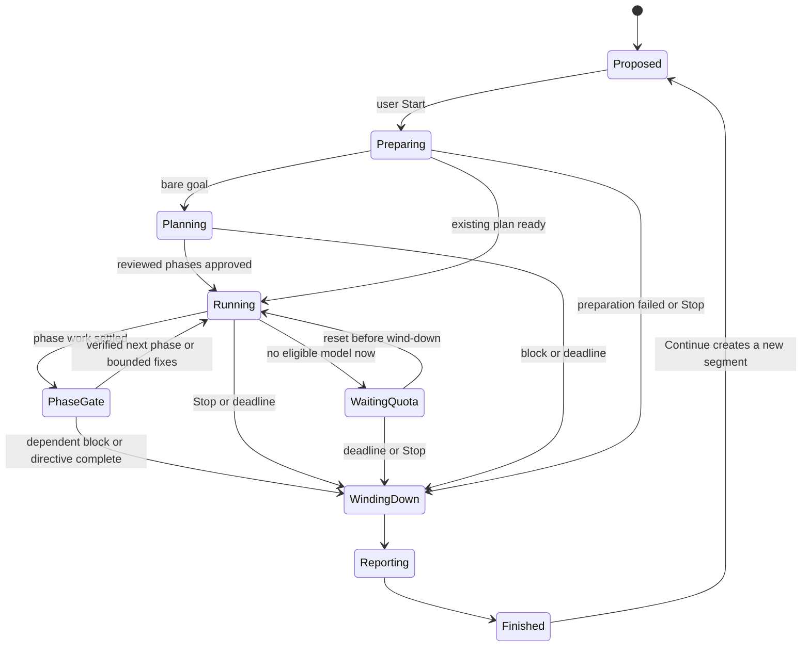

# Brigadier — Build Plan

> Status: agreed design, 2026-09-24. Source of truth for how Brigadier is built.
> Scope: 10 phases from empty repo to signed macOS release plus Windows and Linux builds.

## 1. What Brigadier is

Brigadier is a free, open-source (MIT), local-first desktop app for long-running AI coding sessions. It plays the same role as [bb](https://github.com/get-bb/bb), but is designed to be faster, lighter, and smarter about context, routing, and quality.

The user talks to exactly one **orchestrator**. The orchestrator never does work itself. It plans, delegates to **workers**, talks to them, reviews their results, and reports back. Workers are models from any CLI installed on the machine (Claude Code and Codex first; opencode, Cursor, Qwen and local models later), chosen by skill rather than vendor. To the orchestrator, workers feel like its own subagents. The user can watch workers but never talks to them directly.

### Where Brigadier beats bb (by design)

| Area | bb today | Brigadier |
|---|---|---|
| Context | Delegates compaction to each CLI; child results truncated to 4k chars | Project Brain (knowledge graph) + invisible orchestrator rebirth; no compaction, ever |
| Routing | None; model comes from flags, parent, or project defaults | Layered capability registry + outcome learning + user overrides |
| Fallback | Retries the same provider; no cross-provider failover | Proactive quota balancing + mid-task cross-provider handoff with a quality floor |
| Review | One fixed "review with agent" prompt | Risk-tiered, always cross-vendor; fusion panel + analyst for risky work |
| Freshness | None | Mandatory freshness check against current official docs, cached in the Brain |
| MCP / skills | Each CLI uses its own config | One registry, injected into any vendor per task |
| Runtime | Node server + daemon, sync SQLite stalls, memory leaks | Rust core, single-writer async store, bounded memory |
| Security | Unauthenticated local HTTP API | Authenticated local IPC only; OS sandbox for workers |
| Cleanup | Leaked worktrees and processes; teardown can retry forever | Cleanup ledger per session; everything Brigadier creates is removed; crash sweep on launch |
| Claude integration | Agent SDK (conflicts with Anthropic subscription terms) | The user's own unmodified `claude` binary |
| Platforms | macOS arm64, Linux alpha, no Windows | Universal macOS, then Windows and Linux |

## 2. Core principles

1. **The orchestrator only talks.** It never reads the repo, runs commands, or edits files. Everything goes through workers, and scouts do the looking.
2. **Brigadier owns the truth.** The canonical transcript, task graph, and knowledge live in Brigadier's store. Every CLI session, orchestrator included, is disposable and replaceable.
3. **No vendor preference.** The orchestrator's vendor is excluded from routing inputs.
4. **No AI slop.** Every change is reviewed cross-vendor and verified for real. The final report says exactly what was verified and how.
5. **Never stale.** Anything touching third-party APIs is checked against current docs first.
6. **No new tests by default.** Verification is real: typecheck, lint, build, the existing suite, and a runtime smoke check. Test writing is a toggle. This applies to Brigadier's own development too.
7. **Performance is a feature.** It is enforced by the budgets in §4, not hoped for.
8. **Local-first and private.** No Brigadier backend, no accounts, no telemetry (crash reports opt-in only).
9. **Leave no litter.** Brigadier removes everything it created: worktrees, CLI session files, scratchpads, temp files, processes, and ports. Only task-relevant changes ever reach a commit, and nothing Brigadier didn't create is ever touched.

## 3. Architecture overview

```
┌──────────────────────────── Brigadier.app (Tauri 2) ────────────────────────────┐
│  React UI (system webview)  ── authenticated local IPC ──┐   Menu-bar / tray    │
└──────────────────────────────────────────────────────────┼──────────────────────┘
                                                           │
┌──────────────────────────── brigadierd (Rust core) ──────┴──────────────────────┐
│ Session manager ─ Orchestrator runtime ─ Worker pool ─ Router ─ Quota monitor   │
│ Project Brain (graph + FTS + embeddings) ─ Static code index (tree-sitter)      │
│ Event store (SQLite WAL, single writer) ─ Git/worktree manager ─ Review engine  │
│ Plugin/skill registry ─ Brigadier MCP server ─ Sandbox & OS abstraction         │
└───────┬───────────────────────┬────────────────────────┬─────────────────────────┘
        │ stream-json (stdio)   │ JSON-RPC (app-server)  │ ACP / OpenAI-compatible
   claude (user's binary)     codex app-server       opencode · cursor · qwen · local
```

- **`brigadierd`** is a separate Rust process. The Tauri app launches it, and it keeps running when the window closes (menu bar), so long and unattended sessions continue. It uses Tokio for async work. Blocking work (SQLite, git, indexing) runs on dedicated threads, never on the async runtime.
- **IPC** runs over a Unix domain socket (a named pipe on Windows) with a per-launch secret token. The UI receives a streamed event feed and sends commands. There is no TCP listener by default.
- **Event store:** SQLite in WAL mode. One dedicated writer thread batches appends; there is a read-connection pool. Events are append-only per session. Large payloads (worker transcripts, diffs, screenshots) go to a content-addressed blob store on disk.
- **Data location:** `~/Library/Application Support/Brigadier/`, behind a platform-paths abstraction. Brains are stored per project there, never in the repo.
- **Repo layout** (Cargo workspace plus a pnpm workspace):
  ```
  crates/
    core/        # session manager, orchestrator runtime, worker pool, domain model
    store/       # event store, blob store, migrations
    ipc/         # authenticated local IPC, protocol types (also exported to TS)
    providers/   # adapter trait + claude, codex, acp, openai-compatible adapters
    brain/       # knowledge graph, freshness, retrieval, rebirth briefings
    index/       # static code index (tree-sitter, manifests, service map)
    router/      # capability registry, outcome learning, quota balancing, fallback
    review/      # review tiers, fusion panel, verification pipeline
    git/         # worktrees, session branches, merges, GitHub integration
    registry/    # MCP/plugin/skill registry, config importers/watchers
    sandbox/     # OS abstraction: sandbox, paths, credentials, spawn, shell
    mcp-server/  # Brigadier MCP server (orchestrator + worker tools)
    daemon/      # brigadierd binary
  apps/desktop/  # Tauri 2 shell + React UI
  registry/      # curated model registry (JSON), published via GitHub
  docs/
  ```
- **UI stack:** React 19, Vite, Tailwind 4, and assistant-ui as the complete UI kit.
  - We adopt their design system ([design.md](https://www.assistant-ui.com/design.md)) and their primitives and [elements](https://www.assistant-ui.com/elements), copied into the repo using the **Radix flavor**, and adapt them to our liking.
  - Components run on **ExternalStoreRuntime** over our own state.
  - All icons come from the `@openai/apps-sdk-ui` icon set; lucide is replaced everywhere.
- **Theme:**
  - **Dark only.** One global theme owns every token: color pairs, surfaces, borders, radii, type, spacing, control heights, and pill, button, icon-button, and icon sizes.
  - **Density: Compact / Normal.** A global setting that switches the size and spacing tokens, so the whole app tightens or loosens at once.
  - Copied assistant-ui components are rewritten onto these tokens and keep no hard-coded colors or sizes. A lint rule rejects raw colors and arbitrary pixel values in component code.

## 4. Performance budgets (enforced from Phase 1, reported in the Inspector)

| Metric | Target |
|---|---|
| Core idle RSS | < 60 MB |
| Core RSS with 20 active workers | < 300 MB, excluding the CLI processes themselves |
| App start to interactive | < 1 s |
| First launch to interactive (a new data folder, so it waits for the agent CLIs to list their models) | < 3 s |
| Event ingest to UI paint | < 50 ms p95 |
| UI with 20 streaming worker cards | 60 fps, no long tasks > 50 ms |
| Async-runtime stalls | None > 10 ms (all blocking I/O off-runtime) |
| Brain query (orchestrator tool) | < 50 ms p95 |
| Static index of a 100k-file repo | < 60 s, incremental afterwards |

## 5. Key domain concepts

- **Project:** a workspace of one or more repos. It owns one **Project Brain** and a service map.
- **Session:** one orchestrator conversation in a project. It can live indefinitely, and several sessions can run at once. Its environment is chosen in the composer:
  - **Local checkout:** reviewed task commits land directly on the branch you pick, in your own checkout. Workers still use temporary worktrees for parallel work, created from that branch's latest commit. Your uncommitted changes are never overwritten, and Brigadier asks whether workers should see them.
  - **New worktree:** you pick a base branch, and the session gets its own worktree on a new branch. Worker worktrees are created from the session branch and merge back into it. When the work is done, the session branch merges into the base branch after your one-click go-ahead.
  - In both modes Brigadier's git engine performs merges on the orchestrator's instruction, and a merge worker resolves conflicts.
- **Chat:** a plain conversation outside any project, listed under "Chats" in the sidebar. It is **not** a Brigadier session: there is no orchestrator and no workers. You talk directly to the model you picked. Chats get:
  - web search and attachments;
  - plugins and connectors from the registry;
  - the Personal Brain as memory;
  - automatic fallback when a limit is hit;
  - image generation, quietly routed to Codex and shown inline.

  A chat runs in a scratch folder, with no repo and no code editing.
- **Sidebar:** New chat and Search, then navigation items (Plugins, Scheduled, Usage), then Pinned, then **Projects** (folders with their sessions nested), then **Chats**.
- **Lifecycle** (applies to both sessions and chats):
  - **Hibernate:** automatic when idle. CLI processes stop and temp files are cleaned up, but the session stays in the sidebar, ready to continue.
  - **Archive:** hidden in an Archived view. Workers stop and all leftovers are cleaned up. The transcript and artifacts are kept, so the session is restorable; the orchestrator restarts from the Brain and the transcript. Unmerged branches are kept.
  - **Delete:** permanent. It asks what to do with unmerged branches, and has a "forget what the Brain learned from this session" checkbox, off by default.
- **Permission level** (composer picker, remembered per project):
  - **Ask for approval:** you approve every plan and every change. Sandboxed.
  - **Approve for me** (default): Brigadier approves on your behalf, sandboxed.
    - Small tasks just go.
    - Big, risky, or architectural plans get a stricter fusion-panel review instead of your approval.
    - It stops only for questions only you can answer (product choices, unclear requirements). The affected task waits while other tasks continue.
  - **Full access:** Approve for me without the OS sandbox, shown with an orange warning pill.

  At every level, actions that affect the outside world (push, deploy, publish, remote DB or cloud, credentials) always ask.
- **Cleanup ledger:** Brigadier records every file, directory, process, and port each spawned CLI session creates, including worktrees; Claude transcripts, todos, shell snapshots, paste cache, and file history for that session; Codex thread records; temp folders; dev servers; and headless browsers. They are removed when a task finishes, when a session is archived or deleted, and by a crash-recovery sweep on every launch. Brigadier deletes only what it recorded, never your own CLI sessions.
- **Task:** a unit of delegated work in the session's task graph. It has a type (scout, research, implement, review, merge, verify), a quality floor, an assigned model, and a status.
- **Worker:** a CLI session running one task, in its own git worktree for write tasks. It returns a **structured report**: summary, changes, decisions, verification, open questions, and artifact references. The report is capped at about 800 tokens, and details stay in artifacts.
- **Artifact:** full worker transcript, diff, command output, screenshot, or research note. It is stored in the blob store and retrievable by the orchestrator on demand.
- **Personal Brain:** a small global store of user preferences that applies across projects.

## 6. The phases

Each phase lists its **goal**, **deliverables**, **key design**, and **done when** (verified live in the app or Inspector, not with test suites).

---

### Phase 1 — Foundations

**Goal:** A running skeleton with the architecture, performance discipline, and cross-platform abstraction in place.

**Deliverables**
- Cargo and pnpm workspaces, with the crate layout from §3.
- `brigadierd` with Tokio runtime, structured logging, and a crash-safe lifecycle. Launched by the Tauri app, it survives window close, and there is a menu-bar item.
- Authenticated IPC (socket + per-launch token) with a typed protocol; TS types are generated from Rust.
- Event store (single-writer SQLite WAL, migrations, blob store) and platform paths.
- An OS abstraction trait covering sandbox, paths, credential storage (Keychain), process spawn, and shell. macOS is implemented; Windows and Linux have compiling stubs.
- **Theme foundation:**
  - The assistant-ui design system is copied in (Radix flavor), with a dark-only token set and Compact / Normal density tokens.
  - A lint rule bans raw colors and arbitrary pixel values.
  - apps-sdk-ui icons replace lucide.
- **Bare-bones desktop UI:**
  - A sidebar with Projects (sessions nested) and Chats.
  - A session view using assistant-ui Thread and Composer on ExternalStoreRuntime.
- **Inspector panel** (developer view) showing the live event stream, process list, and performance metrics against the §4 budgets.
- CI on macOS, Windows, and Linux: build, lint, and a launch smoke check on all three.
- Signed and notarized macOS dev build (bundle ID `ai.brigadier.app`, universal, macOS 14+).

**Done when:** The app launches in under 1 s. You can create a project and session and type messages that persist across app restarts. Switching density visibly tightens every control, and no component carries a hard-coded color or size. The Inspector shows live metrics within budget. CI is green on all three OSes.

---

### Phase 2 — Provider adapters (Claude + Codex)

**Goal:** Brigadier can drive both installed CLIs reliably and knows everything about their state.

**Deliverables**
- A `Provider` trait covering start/resume/fork sessions, send turns, steer and interrupt, stream normalized events, list models, and read usage and limits.
- **Claude adapter.** It spawns the user's own unmodified `claude` binary with `-p --input-format stream-json --output-format stream-json --include-partial-messages --verbose`. Model, effort, permission mode, MCP config (`--mcp-config` + `--strict-mcp-config`), appended system prompt and session id are passed as flags, and the process is persistent per session. It never uses the Agent SDK and never touches OAuth tokens. The adapter parses `rate_limit_event`, the assistant `error` field, and `system`/`result` subtypes.
- **Codex adapter:** `codex app-server` over stdio JSON-RPC, with typed bindings from `generate-json-schema`. It uses `thread/*`, `turn/*` (including steer and interrupt), `model/list`, `account/rateLimits/read` + `updated`, `codexErrorInfo`, approval requests, and image-generation items.
- A normalized event model: messages, reasoning summaries, tool calls, commands, file changes, usage, context size, rate limits, and errors.
- Auth detection (`claude auth status --json`, `codex login status`) with clear "log in to X" guidance.
- Live model discovery and a local cache.
- Sandbox and permission mapping. Workers run full-auto inside their worktree under each CLI's OS sandbox (Seatbelt), with network on. Approval requests are routed to Brigadier: Claude via its permission-prompt tool, Codex via `requestApproval`.
- **Replay fixtures:** recorded real sessions that the Inspector can replay to debug adapter parsing.

**Done when:** From the Inspector you can start a raw Claude session and a raw Codex session, stream them, steer them, and interrupt them. Both show live model lists and remaining quota. A simulated usage-limit event is detected and classified correctly.

---

### Phase 3 — The orchestrator loop (first end-to-end flow)

**Goal:** A real session: you talk to the orchestrator, it delegates to Claude and Codex workers, and work lands as commits.

**Deliverables**
- **Orchestrator runtime.** It runs a CLI session with **no built-in tools**, only the Brigadier MCP server. For Claude, built-in tools are disabled and MCP is strict. For Codex, the sandbox is read-only and Brigadier declines every exec or file-change approval. System instructions define the orchestrator role.
- **Brigadier MCP tools for the orchestrator:** `delegate_task`, `message_worker`, `stop_worker`, `ask_user`, `read_report`, `read_artifact`, `query_brain` (stub until Phase 4), `propose_plan`, `request_approval`.
- **Worker runtime.**
  - Task spec goes in, a worktree is created from the session branch's latest state, the worker session runs, progress events stream, and a structured report plus artifacts come back.
  - Workers can ask the orchestrator blocking questions through a worker-side MCP tool.
  - Workers honor the repo's `CLAUDE.md` / `AGENTS.md` whatever their vendor, and do not load the user's personal CLI hooks or plugins.
- **Non-blocking orchestration.** The user can chat at any time. Worker results queue up as events for the orchestrator's next turn, and only final reports and blocking questions enter its context.
- **Git flow:** the two session environments from §5.
  - **Local checkout:** commits land on the picked branch.
  - **New worktree:** a session branch created from the picked base, merged into the base after one-click approval.
  - Worker worktrees are used in both modes.
  - Each accepted task becomes one clean, reviewed commit.
  - Uncommitted changes are never overwritten.
  - PRs always need confirmation.
- **Permission levels:** Ask for approval / Approve for me (default) / Full access, as described in §5, plus the always-ask list for outward-facing actions.
- **Secrets:** a per-project list of gitignored env files copied into worktrees, with values redacted in the UI, logs, and Brain.
- **Composer** (BB parity), built from assistant-ui composer elements:
  - project picker, including "no project", which makes it a Chat;
  - local checkout vs new worktree;
  - branch picker, with "New branch…";
  - permission level;
  - attachments;
  - reasoning effort;
  - provider and model.

  The model and effort choice is resolved in this order: session choice, then the project's remembered choice, then the global default in Settings. The permission level is remembered per project.
- **Message queue:** assistant-ui's Message queue element, extended with:
  - **Steer** (send now into the running turn), delete, a ⋯ menu with edit, and drag to reorder;
  - an editing state and attachment summaries;
  - "Queue paused because you interrupted → Resume";
  - no Queue/Steer setting: a Chat queues what is sent while it replies (Steer sends one in now); a session's orchestrator sorts what is sent while an answer works, joining it to that answer or keeping it queued for its own turn.
- **Chats:** plain conversations directly with the picked model, with web search, attachments, and fallback. Plugins and image generation are added in Phase 7, and memory in Phase 4.
- **Cleanup and lifecycle:**
  - The cleanup ledger, and the pre-commit litter guard, which strips scratch notes, debug scripts, logs, and stray files unrelated to the task.
  - Workers get a scratch folder outside the repo.
  - Crash-recovery sweep on launch.
  - Hibernate, archive, and delete as described in §5.
- **UI:**
  - Worker cards (expandable live transcript, stop/pause).
  - Approval cards.
  - @-mention of worker cards.
  - A plan card.
- Simple routing for now: a static table choosing between Claude and Codex models.

**Done when:** "Add feature X" in a real repo goes all the way through, in both local-checkout and worktree modes. Parallel Claude and Codex workers run in separate worktrees, reports come back, commits land on the right branch, and approvals work. Queued messages can be steered, edited, and reordered. A plain Chat works. After archiving a session, no worktrees, CLI session files, or processes from it remain. The Inspector shows the orchestrator's context growing only by messages and reports.

---

### Phase 4 — Project Brain and the context engine → **self-hosting starts**

**Goal:** Near-infinite sessions, with the orchestrator answering from knowledge instead of re-scouting.

**Deliverables**
- **Static code index** (Rust, no model usage):
  - File tree, tree-sitter symbols and cross-references, package manifests, scripts, and the service map from compose files and manifests.
  - Incremental updates via a file watcher.
  - Exposed to scouts as a fast search tool.
- **Brain graph:**
  - **Node types:** module/service, file summary, decision, convention, preference, task, report, research (dated), contract.
  - Edges between nodes.
  - Retrieval via SQLite FTS5 plus embeddings (local model, or the cheapest cloud fallback).
  - Every node records its provenance: which worker, which session, which commit.
- **Staleness:** file content hashes are tracked, and changed files mark dependent nodes stale.
- **Skeleton pass** on project add, using a cheap model for a few minutes. It records the purpose of each module, the stack, conventions, and the run/build/verify recipe.
- **Idle-quota enrichment** (toggle, on by default). When a usage window is about to reset with quota left over, Brigadier spends it deepening the Brain.
- **Orchestrator rebirth.**
  - Triggers at about 150–200k tokens, between turns only, or when a new message arrives after the session's cache has expired (§7 item 3).
  - The outgoing orchestrator writes a handoff note.
  - The new session gets a briefing of about 15–25k tokens built from the Brain, the handoff note, and the last N messages verbatim.
  - It can search the full transcript on demand.
  - The user sees nothing.
- **Personal Brain:** global preferences, which also serve as memory in Chats (shown with assistant-ui Memory chips), plus an optional export of conventions to `AGENTS.md`.
- **Inspector:** Brain graph viewer, orchestrator context meter, rebirth log.

**Done when:** A session goes through at least 3 rebirths while working on Brigadier itself, with no loss of decisions and no user-visible seams. Repeated questions are answered from the Brain without a scout. **From here on, Brigadier is developed with Brigadier.**

---

### Phase 5 — Routing and resilience

**Goal:** The best model for each task, and sessions that never stall on limits.

**Deliverables**
- **Curated capability registry** (`registry/models.json`). For each model it records vendor, CLI, effort levels, context window, modalities (e.g. image generation is Codex-only), strengths per task category, and a quality tier. The app auto-updates it from the GitHub repo.
- **Live discovery merge:** new models appear automatically. Unknown models are researched (release notes, benchmarks) and tried out on low-risk tasks.
- **Outcome learning:** Brigadier tracks results per model and task category on each project (review pass rate, rework rounds, verification results, time, quota used) and adjusts scores.
- **User overrides:** rules such as "never use X for frontend". Overrides always win.
- **Routing page:** per kind of work, Automatic (the live ranking and why) or Manual (the user's ordered models and efforts, tried top-down; "Only these" waits for them instead of falling to others), everywhere or per project, with area overrides. `never`/`only` rules and Brigadier's hard rules still apply to a Manual list; it waives only the default quality floor, and beats `prefer` rules, pins that don't bind, balancing and trials.
- **Providers and Routing pages:** Providers switches each agent on or off and chooses which of its models are **available** (in every model picker and on Routing); an agent off or a model unavailable gets no work at all, background jobs included, while conversations already running keep their model. Routing chooses which available models the orchestrator **may give worker tasks to**. A model seen after its agent's first list starts available but gets no worker tasks, trials included, until the user allows it on Routing (user decision 2026-10-01).
- **Routing explanation** on every worker card ("why this model").
- **Quota monitor:** Claude's 5-hour and weekly windows, and Codex's primary and secondary windows. Rolling usage estimates, with **proactive balancing** that shifts work to other providers when a window runs hot.
- **Fallback:**
  - Each task has a **quality floor**.
  - On a limit or error, Brigadier hands off mid-task to the best eligible model, in the same worktree, with the task spec, progress log, and current diff.
  - If nothing eligible is left, that task pauses and shows the reset time while other tasks continue.
  - The orchestrator falls back through rebirth.
  - A temporary fallback never overwrites the user's saved model choice.
- **Usage dashboard** in the UI.

**Done when:** Claude and Codex workers are chosen for sensible, explained reasons. A forced Claude limit mid-task hands off to Codex and the task completes. The dashboard reflects real quota windows.

---

### Phase 6 — Quality engine

**Goal:** No AI slop: everything reviewed, verified, and up to date.

**Deliverables**
- **Review tiers, scaled to risk:**
  - **Per-task checks (user decision, 2026-10-04, every session):** one reviewer and one verifier per change. A change to documentation only gets a verifier alone, which checks the done-when criteria and the docs against the code without builds, tests or smoke runs. A change to a risky area (a path naming landing, policy, the sandbox or git) gets a second reviewer. A change that couldn't be verified is held; there is no automatic second verifier. A fix round always gets a fresh verifier on the new candidate, and asks again only the reviewers that asked for changes: the verifier checks the fix against the approvals kept.
  - Large, risky, or architectural work, including its plan, gets the **fusion panel**: parallel independent reviewers from different vendors, plus an analyst that reports consensus, contradictions, gaps, unique insights, and blind spots.
  - Confirmed issues go back to the original worker to fix.
  - `/fuse` forces a full panel, and when Brigadier approves on your behalf (Approve for me, Full access), risky plans always get the stricter panel.
- **Verification pipeline** (per project, learned into the Brain):
  - Typecheck, lint, and build.
  - The existing test suite. If a change breaks an existing test, the worker fixes the code; it edits the test only for an intended behaviour change.
  - A runtime smoke check: start the app, hit endpoints, or run a headless browser with screenshots attached for reviewers.
  - The final report states exactly what was verified.
- **Test-writing toggle:** per project (off by default), with a per-session override. When on, workers write only focused, meaningful tests.
- **Freshness check:**
  - Any task touching a third-party library, API, SDK, CLI, or service triggers a research scout, which checks official docs and changelogs.
  - Results are stored as dated Brain nodes with a TTL of about 7 days and are invalidated when a version changes.
  - New dependencies use the latest stable version.
  - Existing dependencies are coded to the installed version; upgrades are suggested, never applied silently.
  - Every prompt includes today's date and each model's knowledge cutoff.

**Done when:** A risky feature gets a fusion-reviewed plan and diff, with issues caught and fixed. The smoke-check screenshot shows up in the review. A stale-API scenario (a library changed after the model's cutoff) is caught by the freshness check.

---

### Phase 7 — Plugins, skills, local models, more providers

**Goal:** Every capability on the machine, available to every vendor.

**Deliverables**
- **Unified registry:**
  - **Plugins screen:** MCP servers and connectors, each with its own auth, on/off switch, and permissions.
  - **Skills screen:** `~/.agents/skills` is the canonical folder, plus `<repo>/.agents/skills`.
- **Importers and watchers** for Claude (`~/.claude.json`, `.mcp.json`, `~/.claude/skills`, plugins), Codex (`~/.codex/config.toml`, skills, plugins), Claude Desktop, and Cursor. Brigadier never edits their configs.
- **Per-task injection:** each worker gets only the relevant plugins and skills, via `--mcp-config` for Claude and config overrides for Codex. The orchestrator sees only a catalog.
- **Vendor-exclusive built-ins** such as Codex image generation and computer-use are exposed as router capabilities. Generated images are saved into the project where the user chooses.
- **Local models** via an OpenAI-compatible endpoint (Ollama, LM Studio, llama.cpp):
  - Helper jobs: titles, commit messages, report→node summaries, embeddings, classification, and a second check on redaction.
  - Trivial worker tasks, via opencode.
  - **Local-only mode** per project.
- **ACP adapter** covering opencode, Cursor (`cursor-agent acp`) and Qwen, with quirk handling per vendor.
- Image and screenshot attachments everywhere, routed to vision-capable models.
- **Chats get the full set:** plugins and connectors from the registry, and image generation routed quietly to Codex and shown inline, even when chatting with Claude.

**Done when:** An MCP server configured only in Claude is used by a Codex worker. A skill from `~/.agents/skills` is applied to a Codex task. A local model handles titles and summaries. opencode works as a worker if it is installed.

---

### Phase 8 — Multi-repo projects and GitHub

**Goal:** Microservices and the full dev loop.

**Deliverables**
- **Multi-repo workspaces:** a project spans several repos, with one Brain and a service map. Services are nodes and contracts are edges (HTTP, events, shared types).
- **Contract-first changes across services:** the contract task comes first, then per-service workers run in parallel, and one reviewer checks both sides of each contract.
- **Impact analysis:** a contract change automatically plans follow-up tasks for its consumers.
- **Session branches** only in the repos a session touches, with **linked PRs**.
- A cross-service smoke check using the learned "run the system" recipe (compose, scripts, ports).
- A **merge worker** for conflicts between workers, followed by re-review.
- **GitHub integration** via `gh`: PR creation (with confirmation), review comments into the session, CI status, and "fix failing CI".

**Done when:** A change spanning two services in two repos lands contract-first with linked PRs. A red CI run on a PR is fixed by a session.

---

### Phase 9 — Product UI

**Goal:** Turn the bare-bones app into the product.

**Deliverables**
- **A full design pass on the assistant-ui design system and elements**, adapted to our dark theme and density tokens. Element mapping:
  - Worker cards: Subagent list, Task card, Agent status.
  - Approvals: Approval card, Permission grant.
  - Plans: Agent plan, Todo list.
  - Fallback notices: Handoff.
  - Usage: Quota banner, Cost meter.
  - Inspector: Context breakdown, Trace waterfall, Tool timeline.
  - Task-graph panel: Flow graph.
  - Diffs: Code diff, Reviewable diff.
  - Files and terminal: File tree, Terminal block.
  - Embedded browser: Web preview.
  - Plugins screen: MCP config dialog, Server panel.
  - Automations: Schedule card.
  - Personal Brain: Memory chips.
  - Sidebar: Thread list sidebar, Thread search.
  - Also: Command palette, and Model selector with reasoning effort.
- Session view polish: streaming performance at the §4 budgets, virtualized timeline, and lazy-loaded worker transcripts.
- **Diff viewer** with "select lines → add to chat".
- **Terminal** (xterm.js over a PTY from the core).
- **File tree and viewer** (read-only), plus "Open in Cursor / VS Code / Zed".
- **Embedded browser** with element annotation ("fix this"), shared with the smoke checks.
- **Task-graph panel**, which replaces a kanban board.
- **Native notifications:** approval needed, worker blocked, session done, limit hit.
- **Automations:** scheduled or recurring sessions that run under Approve for me.
- **Settings:** density (Compact / Normal), default orchestrator model and effort, default permission level, test toggle, secrets list, routing (rules and manual rankings, on the Routing page), plugins, skills, local models, enrichment toggle.
- The Inspector stays available as a developer view.

**Done when:** A full day of real work on Brigadier happens in the app without falling back to a terminal, at the performance budgets.

---

### Phase 10 — Release: macOS, then Windows and Linux

**Goal:** Ship.

**Deliverables**
- **macOS:**
  - Signed and notarized universal DMG (Developer ID).
  - Homebrew cask.
  - Tauri signed updater with Stable and Nightly channels, published from GitHub Releases.
- **Windows:**
  - A real sandbox implementation: Codex's native sandbox, and Claude with WSL guidance where needed.
  - Credential storage and paths.
  - A signed MSI or NSIS installer.
- **Linux:** AppImage and .deb, with a WebKitGTK compatibility pass.
- **Performance hardening:** benchmark report against bb (memory, CPU, latency, and context per feature).
- **Docs:** install, first project, concepts (orchestrator, Brain, routing), privacy.
- Optional crash reporting (opt-in).
- MIT license and contribution guide.

**Done when:** Public v1.0 release on all three OSes, with the auto-updater verified end to end on macOS.

## 7. Token economy (rewritten 2026-09-30 from measurements; built in, with no settings, since 2026-10-01)

**Goal:** Teams that use AI all day stop running out of Claude and Codex usage, without losing context or slowing down, and sessions run as long as the user wants without the model losing track. Brigadier does this by itself in every session.

**Rules**
- **No budgets or caps.** Nothing stops, throttles or interrupts work to save usage.
- **Context is never dropped silently.** A fresh CLI session under a Brigadier session or task is allowed (rebirth, hand-off), because the Brigadier session goes on and what the old CLI session knew is carried over: a handoff note, the decisions, the last messages word for word, and the full transcript on disk. Cutting or summarizing inside a running CLI session without that is not.
- **Lossless.** What leaves the model's view stays retrievable, and the model is told where.
- **No settings.** The user never chooses how lean a session runs: Brigadier ships the best behaviour it has measured, always on, and tells nobody to turn anything on.
- **Judged per completed task.** A change ships only when completed tasks show less usage at equal quality: the share of each quota window used, the calls, rework, verification and whether any decision was lost. Results stay separate per provider and project. Fewer tokens per call that cause extra calls later are a loss (cutting tool output by 38% raised one bill by 7%: [arXiv 2607.12161](https://arxiv.org/abs/2607.12161)).

**What the usage is made of** (re-measured 2026-09-30: 25,930 Claude Code calls over 30 days on one heavy user's machine, 98.6% Opus 5.5, 85% of it Brigadier development; weighted by Opus 5.5 API prices, since neither vendor publishes how subscription limits weigh tokens, so every share is an estimate)
- Cache reads 59.4%, one-hour cache writes 19.3%, five-minute writes 5.2%, output 16.1%.
- **Context size is the whole game:** 57.7% of usage comes from calls made at 200–500k tokens of context, 25.3% at 100–200k. Every call re-reads the whole context.
- Tool results are about 30% (Bash 20.6%: mostly successful file reads with `sed`, `cat` and `grep`). Build, test and lint output is under 1%.
- Output: thinking 32%, tool-call inputs 37.5%, visible prose 5.6%.
- Hand-run sessions: median 4 and mean 21 calls per user message; 66% of messages come within 5 minutes, 3.1% after more than an hour. Brigadier's orchestrator: 1.7 calls per message, about 1.6k tokens of growth per message.
- The fixed start of a fresh session is shared through the cache across sessions: a second new session with the same flags within the hour writes 0 tokens and reads it all.

**The six outside tools and the Brain** (full study: the 2026-09-30 token-tools report)
- **None is integrated.** headroom rewrites requests through a local proxy (not allowed on subscription sign-in, and its lossy transforms cut file reads the model asked for; 0.45% lossless). RTK saves 0.21% on our mix and its hook grants permissions from the user's own settings. Graft and graphify add about 1.1% if their hooks run every session. caveman's rules cost more to carry than they save. ponytail's rules are about 0.2–0.4% of writes.
- **Borrowed:** ponytail's rules for writing code (item 4), a plain-English voice in our own words that keeps caveman's brevity without its slang and without its name, plus the unslop checklist's rules against over-compression (item 5). Worth borrowing later: headroom's lossless JSON-table folding for large MCP output, RTK's per-command digests for an output store (item 8), Graft's ranking for plain-language code questions in `crates/index`.
- **The Brain stays.** Neither Graft nor graphify stores decisions, conventions, provenance or rebirth briefings; on code questions plain `rg` beats both on exact names. The finding that matters: workers made 0 calls to Brigadier's code tools in 30 days, because the worker prompt never named them (item 4).

**Built in (2026-10-01), with no settings.** Everything below always runs: the worker hand-off at 160k, rebirth when the cache has expired, lean worker tools, code pointers, the code rules, the Brain's caps and code-name routing, and one plain, brief voice. Settings → Usage has no switches for them, and a saved settings file that still holds the old `usage` switches loads and ignores them. Debug builds keep `BRIGADIER_CACHE_TTL_SECS`, `BRIGADIER_COLD_REBIRTH_TOKENS` and `BRIGADIER_WORKER_HANDOFF_TOKENS` for testing.

1. **Measurement.** Per-task usage already lands in `routing.sqlite` (`turn_usage`: input, cached input, cache writes and output per turn, by task and conversation) and quota readings in `quota_samples`. The A/B harness drives a debug daemon with its own data directory over IPC and compares arms on the same tasks. Still to build: a per-task report in the Inspector, and cache writes split by cause.
2. **Hand long workers to a fresh session** at 160k tokens of context. Workers are where the 200–500k calls are. Once a worker's context passes the size mid-turn, it is asked to finish its current step and end its turn with a handoff note; a fresh session of the same model continues in the same worktree with the note, the last six messages word for word, any pending message, and `<scratch>/handoff/` (spec, progress log, diff and the whole transcript). A message for a worker between turns past the size starts the fresh session at once. It never happens inside a tool call, and it keeps the task's model and attempt. Replayed on the real sessions, a hand-off at 160k saved an estimated 13.2% of usage (16.2% at 100k, 10.2% at 300k).
3. **Rebirth an orchestrator when its cache has expired** (Claude only). An orchestrator idle past its one-hour cache would rewrite its whole history at 2× on resume. While the cache is still warm (at 5/6 of its lifetime) a fork writes a checkpoint handoff note; if the next message comes after the cache expired, the orchestrator is reborn from the usual briefing plus that note instead of resuming. Without a checkpoint that covers the last request, it resumes as before. The last request is tracked per native session and recovered from the orchestrator log after a restart. Codex stays off until its cache lifetime through the app-server is measured. Modelled saving: about 20% of orchestrator usage over a 50-message session (an estimate).
   - The checkpoint's fork keeps the cache warm. Measured on Claude Code 2.1.285: a fork at 50 minutes read the whole history from the cache and wrote its own few tokens at the one-hour lifetime. Twenty minutes later, a resume of the parent read all 23.9k from the cache, while a control session without a fork had to write 19.4k again. So the cache counts as expired only one lifetime after the checkpoint. This was checked live with a 240 s debug lifetime. A turn at 285 s resumed and read 12.2k from the cache, writing 49 tokens. A turn at 541 s was reborn from the checkpoint and kept a commitment from the first message.
   - **Proposal, not built: keep the cache warm on purpose.** A tiny fork call refreshes the cache for another hour, at about 0.05× the context. A rebirth costs about 2× a 20k briefing. At a 150k context that is about 7.5k per hour kept warm against about 45k for one rebirth, so keeping it warm pays for gaps up to about six hours. Past that, rebirth wins. This needs the user's view on background calls while nobody is working.
4. **Lean worker tools, pointers and code rules.**
   - Claude workers start without 16 built-in tools they never use: 15.0k → 10.1k tokens at the start of every request (measured on Claude Code 2.1.285), an estimated 1.6% of usage. Codex keeps Brigadier's current flags: a leaner Codex prompt lost the shared cache (0 cached tokens against 11.4k), so it cost more.
   - Workers are told to find code with `code_search`, `code_refs` and `project_map` before grepping or reading whole files, and Brain answers name each hit's files.
   - Implement and merge workers follow short code rules adapted from ponytail: read and trace the code first, reuse what the repository, the standard library or an installed dependency already has, write the least code with no unrequested abstraction, fix bugs at the root and keep every caller of a changed function correct, and never simplify away validation, error handling or security checks. Its modes, hooks, output format and "leave one runnable check" rule are left out (the last conflicts with Q10).
   - Brain answers hold at most 4 facts, 3 modules or files and 2 passages, say how many more there are, and give the rest on page 2. A question that names code (an identifier, a path or a quoted name) also gets the code index's hits for it. Measured on 11 real questions: stale nodes leading answers went from 1 to 0, and answers were 29% shorter.
5. **One voice.** The orchestrator and the workers' reports share one short rule set: answer first, no filler, recap or pleasantries; whole, plain sentences with their articles and verbs, no arrows or symbol-speak, no jargon; and nothing lost: every fact, number, path, negation and condition stays, with full care for security, irreversible and order-dependent steps. Measured on 5 prompts × 2 runs on Sonnet 5, no terse wording saved output tokens (the run-to-run spread for the same prompt was up to 3×), so this is about readability more than usage.

**A/B on real Brigadier tasks (2026-09-30).** A debug daemon ran each arm on its own copy of the repository at 49bdf1c, with an Opus 5.5 orchestrator and workers pinned by a routing rule. n is 1 per arm, so every usage difference below is a direction, not a measurement.
- **Worker hand-off, quality.** H1 was a docs task: a glossary of 10 types, then a follow-up from the orchestrator adding 4 more "in the same format and order you chose". It ran with the size lowered to 25–27k so the hand-off had to fire.
  - Codex (gpt-6.1-sol): one hand-off with a note.
  - Claude (Opus 5.5): two hand-offs. One was mid-turn with a note; the other was between turns, carrying the follow-up.
  - In both, the worker's own format and sort-order decisions and its commitments survived every seam. The file had 14 correct entries and a correct report, the same as without a hand-off.
  - The note also carried an honesty point: a check that had failed to run must not be reported as passed.
  - A worker already done when asked to wrap up reported instead of handing over, as the steer allows.
- **Worker hand-off, usage.** At a 25–27k size it costs more: each fresh session writes its start to the cache again. Claude came to 107k weighted vs 72k without a hand-off; Codex to 92k uncached input vs 23k. That is expected, because a hand-off only pays where the context is large. The saving estimate stays the transcript replay: about −13% of usage at 160k. It needs a long real task to confirm.
- **Savers (lean tools, code pointers, build rules, concise).** Two scout questions with known answers, each arm on Claude (Sonnet 5 worker) and Codex. Every answer was correct in every arm.
  - Claude with savers: the first request went from 30.7k to 26.0k tokens, and calls fell from 20 to 12. Weighted worker usage fell by about 13% (177k to 153k).
  - Codex with savers: calls went from 9 to 11, uncached input from 49k to 39k and cached input from 190k to 193k. So there is no clear change: Codex keeps its default tools, and the rest is prompt text.
- **Concise voice.** 5 prompts, 2 runs each, on Sonnet 5 with `claude -p`. No terse wording saved output. Ours with the unslop rules came out at +39% output tokens, inside a run-to-run spread of up to 3× for the same prompt.
- **Rebirth when the cache has expired.** 3 of 3 live rounds on a debug daemon with a 10-minute debug lifetime passed. Each wrote a checkpoint while the cache was warm, was reborn with trigger `cacheExpired`, and kept a commitment made in the first message, 8 to 24 exchanges back and far outside the verbatim tail.

**A/B of the built-in set (2026-10-01).** A debug daemon ran main 030d0b1 (old defaults: hand-off, voice, code rules and Brain caps off) against the built-in set, on a throwaway clone of a real TypeScript monorepo. Both arms used the same seeded Brain and an Opus 5.5 orchestrator, and workers were pinned by a routing rule (Claude: Sonnet 5 scouts and Opus 5.5 implementers; Codex: gpt-6.1-sol). Each run started with the same warm-up, and the order of the arms alternated. Usage is weighted by API prices (input 1, cached 0.1, cache write 2, output 5). Most rows are n=1, so they show a direction, not a measurement.
- **Long task past 160k (Claude, n=1 per arm).** A two-part implement task: usernames with one dot (a plan file first, then the code, a migration and texts in three locales), then a username-change feature that had to reuse part 1's decisions. Old: one session up to 316k, 187 calls, 4.53M weighted. New: two hand-offs at 161k and 162k, 163 calls, 2.77M weighted (−39%). After both hand-offs the new worker reused part 1's check, migration method and sentence exactly, and recorded its two departures in the plan. Both diffs were complete. The old worker found a way to install dependencies and run typecheck and tests, while the new one decided in its first session, before any hand-off, that it could not, and reported every check as not run. In the single-part version of the task (111k at most, no hand-off) neither arm ran checks, and usage was equal (707k against 691k).
- **Scout with a known answer (Claude, n=4 per arm).** 13 facts each. Old answers had 10, 13, 8 and 8 of them, new answers 10, 10, 8 and 8. In every run the orchestrator's answer kept all the facts its worker found, so the misses are the worker's search, not the voice. Answers averaged 316 words old and 304 new. Usage was 565k old and 615k new over four runs (+9%, inside the run-to-run spread of 98k–198k per run).
- **Implement task with a follow-up across a hand-over (n=1 per arm, hand-off lowered to 40k).** A small shared helper with 9–10 call sites, then a follow-up that had to match a choice the worker made in its first turn. Claude and Codex both handed over, and both kept the choice. Their call sites matched the old arm's. Usage was higher with the forced hand-off: Claude +36% and Codex +10%, as expected for a hand-off on a small context. It is a correctness check, not the shipped size.
- **Codex scout (n=1 per arm).** 12/13 old and 13/13 new; usage +13%, within noise.
- **Brain caps and rebirth (Claude, n=2 per arm).** With 8 matching decisions, the new answer held 4 and ended "3 more facts; ask with page 2 or a narrower question.", and page 2 returned exactly the other 3 (old: every hit at once, and page 2 repeated them). Probe sessions used 31% less. After a cold rebirth (a 240 s debug cache lifetime; the message came at 540 s, one lifetime after the checkpoint), both arms answered a seeded decision correctly.
- **Found: the code index misses TypeScript definitions.** On this repository it holds 2 function definitions across 1,685 TypeScript files: `export function validateUsername` is not indexed. So code-name routing added nothing here, and `code_search` finds little in TypeScript projects. This was already so on main; fixing the TypeScript tags query is a separate task. **Fixed (2026-10-02):** the TypeScript grammar's bundled tags query only adds to the JavaScript one, and the index used it alone. TS, TSX and JS now get the JavaScript query, the TypeScript one and our own patterns (exports with their doc comments, type aliases, enums, namespaces, class-field functions, top-level constants, JSX component uses). On a copy of iBeep: definitions 454 → 12,847 (functions 2 → 7,384), references 9,852 → 80,977, full index 0.11 s → 0.39 s, database 3.4 MB → 22.7 MB. The index schema went to version 4, so existing indexes rebuild on their next scan.

**Proposals that need the user's decision**
- **Fresh `claude -p` / `codex exec` per user message: no, as a default.** For the orchestrator (about 2 calls per message) a 50-message session costs about 2.5× more than resuming, and every message is a lossy seam. It pays only for long agentic turns, and the worker hand-off (item 2) captures that saving at one seam per 160k instead of one per message. The stripped fixed start the idea relies on is item 4.
- **Replacing the Brain with Graft or graphify: no.** Keep the Brain; borrow Graft's plain-question ranking into `crates/index`.
- **Settings for these:** none (the user, 2026-10-01). Everything in items 2–5 is built in.

**Not doing, and why**
- Output caps, per-step token limits and history trimming break the rules above.
- Lossy prompt compression and request-rewriting proxies (headroom): lossy, and not allowed on subscription sign-in.
- Batch APIs are discounted only on API billing.
- Stripping Codex's fixed start further: it loses the shared cache.
- `--bare` for Claude: it needs an API key, so it doesn't work on a subscription.

**Next, in order**
1. Per-task usage in the Inspector, and cache writes by cause.
2. A lossless command-output store (RTK's digests, full output kept with an ID), for projects with heavy build and test output.
3. Precise, batched reads from the code index (outline, one symbol, a line range).
4. Thinking: effort per step where the model keeps its cache across effort changes; per task elsewhere.

---

## 8. Risks and open items

| Risk | Mitigation |
|---|---|
| Anthropic's terms for third-party use of subscriptions change | Run only the user's own unmodified `claude` binary, and never handle tokens. Watch the policy, and support API-key auth as an alternative. |
| `codex app-server` is marked experimental; its API may change | Generate bindings from the installed version's schema, detect the version, and isolate everything in the adapter crate. |
| Codex orchestrator cannot fully disable its built-in tools | Use a read-only sandbox, and have Brigadier decline every approval. Verify in Phase 2, and prefer a Claude orchestrator if needed. |
| Rebirth loses unrecorded nuance | Handoff note, verbatim recent messages, full transcript search. The Inspector compares before/after. |
| Model names and capabilities change fast | Live discovery, a curated registry updated independently of app releases, and the freshness check. |
| Windows sandboxing is weaker | Sandbox trait from Phase 1. Use WSL for Claude where required. Clearly document Windows limitations. |
| WebKitGTK quirks on Linux | CI launch checks from Phase 1 and a dedicated compatibility pass in Phase 10. |
| A CLI changes its MCP protocol under us (2026-09-30: Claude Code 2.1.285 began offering MCP 2026-07-28, which requires cache fields on `tools/list`; without them every session started with no Brigadier tools) | Set every field the newest protocol requires. Check that a session's Brigadier tools loaded (the CLI's MCP log, or a tool missing from its init event), and say so in the Inspector instead of letting the orchestrator run without them. |

## 9. Decision log (grilling session, 2026-09-23)

| # | Decision |
|---|---|
| Q1 | Public, free, MIT, local-first; no backend or accounts; open-core possible later |
| Q2 | Pure orchestrator + scouts + Project Brain + rebirth instead of compaction |
| Q3 | Autonomy modes; irreversible and outward-facing actions always confirm (levels finalized in Q27) |
| Q4 | Layered routing: curated + discovery + outcome learning + overrides |
| Q5 | Proactive quota balancing + mid-task cross-provider fallback with a quality floor |
| Q6 | Risk-tiered, cross-vendor review; fusion panel for risky work and plans |
| Q7 | Worktrees per worker; accepted tasks land as clean commits (branch semantics superseded by Q23) |
| Q8 | Workers visible as read-only live cards; redirect via the orchestrator |
| Q9 | Mandatory freshness check, cached in the Brain |
| Q10 | No new tests by default, real verification; test-writing toggle |
| Q11 | One plugin/skill registry, injected into any vendor per task |
| Q12 | Tauri 2 + Rust core |
| Q13 | One Brain per project, shared live across sessions, + Personal Brain; stored outside the repo |
| Q14 | Projects span multiple repos; service map, contract-first changes, impact analysis |
| Q15 | Full auto inside the OS sandbox; short always-ask list; secrets redacted |
| Q16 | Bare-bones app + Inspector from day one; self-host from Phase 4 |
| Q17 | Orchestrator model: session picker → per-project remembered choice → global default |
| Q18 | Brain seeding: static index + skeleton pass + lazy learning + idle-quota enrichment |
| Q19 | Local models as free helpers + trivial workers + local-only mode |
| Q20 | Feature scope per the table (diff, terminal, files, browser, GitHub, usage, automations, notifications); side chats later dropped in favor of Chats (Q24) |
| Q21 | MIT, no telemetry, universal macOS 14+, DMG + Homebrew, signed updater, `ai.brigadier.app` |
| Q22 | Cross-platform core from day one; Windows and Linux ship in Phase 10 |
| Q23 | Composer environment: Local checkout (commits on the picked branch) or New worktree (session branch from the picked base, merged into it on approval); worker worktrees in both |
| Q24 | Chats are plain conversations with the picked model (no orchestrator), under "Chats" in the sidebar |
| Q25 | Archive (hidden, cleaned up, restorable) / Delete (permanent, Brain knowledge kept by default); idle sessions hibernate |
| Q26 | One permission picker combining autonomy and sandbox; outward actions always ask (levels finalized in Q27) |
| Q27 | Levels: Ask for approval / Approve for me (default; stricter fusion review approves big plans on your behalf; stops only for questions only you can answer) / Full access (no sandbox, orange pill) |
| — | Additions (2026-09-24): leave-no-litter cleanup ledger and litter guard; BB-parity composer; message queue (steer, edit, reorder, pause/resume); a sidebar with Projects and Chats; assistant-ui design system + elements as the full UI kit; dark-only theme with Compact / Normal density, everything token-driven |
| — | Token economy (2026-09-28, revised 2026-09-30; superseded by the next row): no budgets and no shortening sessions; lossless reductions judged per completed task on quality plus observed quota-window use; in order: measure first, precise and batched reads, a lean stable fixed start, thinking (effort per step where the cache survives), cache-aware idle with rebirth instead of resume when the cache is cold, a terse orchestrator voice (caveman), a command-output store (own filters, a Brigadier `run` tool for Codex), cheap-model digests; no fresh session per user message (§7) |
| — | Token economy rewritten from measurements (2026-09-30, §7; its switches and defaults superseded by the next row): context size is the lever (58% of usage at 200–500k); none of headroom, Graft, RTK, ponytail, caveman or graphify is integrated (techniques borrowed); the Brain stays; built behind settings, off until completed tasks show equal quality: worker hand-off to a fresh session at a size (default 160k), orchestrator rebirth when its cache has expired (Claude only), lean Claude worker tools, code-tool pointers, build rules, a plain-English concise voice (readability, no measured saving). On by default after the A/B (the user, 2026-09-30): rebirth when the cache has expired, lean worker tools, code pointers; the worker hand-off after one long real task confirms its saving; concise replies and build rules off. Proposal for the user: no fresh session per user message as the default |
| — | No session settings; best behaviour built in (2026-10-01, §7): no user setting for any usage behaviour. The worker hand-off at 160k, rebirth when the cache has expired, lean worker tools, code pointers, the code rules, the Brain's caps and code-name routing, and one brief, plain, lossless voice always run; nothing tells the user to turn anything on |

---

## 10. Overnight mode (reviewed design, 2026-10-02)

**Goal:** Give Brigadier a plan, optionally say when the report should be ready, press Start, and leave. Brigadier works through the phases, independently verifies each whole phase, fixes findings, and continues until it finishes, reaches the deadline, or needs something only the user can provide. The morning starts with reviewed work on its own branch, a report in the conversation and a notification from Brigadier.

**Status and authority:** This section is the Phase 1 design at baseline `c2d2756`; implementation and live verification are separate phases. It implements the user's settled G1–G18 decisions from the 2026-10-02 grilling. Cross-vendor plan review approved it with F1–F14 corrections, all accepted by the Delegator and incorporated here. Design approval does not authorize shipping. Where earlier sections describe session defaults, overnight's run-scoped behaviour below applies during the run. No new user settings, quality controls, Reports page or overnight model table.

### 10.1 What already exists, and what must change

The following references are to `c2d2756`, before this section was added. Reuse these paths; do not build a second worker, router, review or event-store system.

| Existing code | What overnight mode builds on |
|---|---|
| `crates/core/src/work.rs:764`, `:790`, `:812` | `PlanStep`, `PlanState` and `Plan` already represent plans and review revisions. They have no phase criteria, deadline or run lifecycle. Add run records without changing normal-plan start behaviour. |
| `crates/core/src/work.rs:1155`, `:1173`; `crates/core/src/manager/requests.rs:26` | Requests own user messages and their tasks/cards. Add explicit phase ownership; deriving a phase from the newest request would attach late results to the wrong phase. |
| `crates/core/src/model.rs:1085`; `crates/core/src/board.rs:112`; `crates/core/src/sessions.rs:81` | Append-only domain events, board projection and store replay provide durable truth. Add typed run events and replay them into the board. |
| `crates/core/src/manager/mod.rs:140`, `:195`, `:214` | Manager startup runs recovery before timers; shutdown closes every CLI. Conductor recovery must participate before ordinary recovery disposes of active run work. |
| `crates/core/src/manager/conversation.rs:3282`; `crates/core/src/sessions.rs:556` | Conversation runtime/request attribution and assistant-message persistence provide fresh phase turns and the final thread report. Keep native CLI contexts disposable. |
| `crates/core/src/manager/workers.rs:721`, `:1269`, `:1429` | Task creation, worker workspaces and serialized session worktree creation. Extend them with immutable run/phase context; never change the session setup beneath old tasks. |
| `crates/core/src/manager/landing.rs:54`, `:266`, `:890`, `:1067` | Candidate creation, task gates, safe landing and user-confirmed session merge. `finish_session` requires a NewWorktree session, merges its tip and checks all open write tasks. Add a distinct run-merge path for the run's verified SHA, independent of session setup. |
| `crates/core/src/work.rs:361`, `:505`; `crates/core/src/manager/gates.rs:98`, `:642` | Task/plan gate records and the bounded automatic fix loop. Add a phase owner and full-phase checks rather than treating passing task gates as phase completion. |
| `crates/core/src/manager/plan_gates.rs:46`, `:67`; `crates/core/src/manager/tools.rs:523` | Two plan-review rounds, findings with IDs, revisions answering every finding. Reuse for each phase plan and Phase 0. |
| `crates/core/src/work.rs:215`; `crates/core/src/manager/decisions.rs:327` | Reports already carry done-when evidence, risks and user-only needs; Waiting items can be answered. Add criterion IDs and run/phase provenance, preserving old report decoding. |
| `crates/core/src/manager/watchdog.rs:1`; `crates/core/src/manager/worker_handoff.rs:61`, `:210` | Stall recovery and context handoffs already exist. Add a terminal handoff purpose that saves work without automatically launching a successor. |
| `crates/core/src/manager/routing.rs:193`; `crates/core/src/manager/workers.rs:3260`; `crates/router/src/decide.rs:161` | Router preview, task-kind-to-category mapping and category floors, respectively. The router's existing planning-related category is `Orchestrate`; there is no `Planning` category. Route phase leads and judges through `Orchestrate`, without adding an overnight setting. |
| `crates/core/src/manager/rebirth.rs:357`; `crates/core/src/manager/fallback.rs:244`, `:454` | Fresh orchestrator briefing, successor startup and handoff file writer. Reuse with an explicit phase briefing instead of default recent-message carryover; recover cut-off tasks through the existing handoff/successor path. |
| `crates/core/src/manager/workers.rs:745`; `crates/core/src/manager/routing.rs:336` | Existing “slots” are model-trial counters, not a worker semaphore. Add a per-run task-start counter; normal sessions remain uncapped. |
| `crates/providers/src/policy.rs:19`, `:119`; `crates/core/src/manager/workers.rs:1942`; `crates/core/src/manager/cards.rs:263` | Outward-action classification and approval routing. Overnight must return a denial plus a durable Waiting item immediately, instead of holding a command for the current 15-minute approval timeout. |
| `crates/core/src/manager/workers.rs:1238`; `crates/daemon/src/gate.rs:1`, `:28`; `crates/providers/src/claude/mod.rs:418`; `crates/providers/src/codex/mod.rs:1086` | `worker_access` already uses `Access::Scoped` for worktree/scratch writes, task network, denied reads and allowed sockets; adapters enforce vendor OS sandboxes. PATH shims are additional protection and absent on Windows. Extend the existing sandbox and spike actual bypasses before adding a broker. |
| `crates/core/src/manager/secrets.rs:17`; `crates/core/src/model.rs:106` | Session workers currently copy configured secret files. Overnight must not copy or expose those files automatically. |
| `crates/core/src/manager/lifecycle.rs:76`, `:258`, `:280`; `crates/core/src/ledger.rs:254` | Recovery, idle hibernation, activity detection and orphan cleanup. Current recovery ends interrupted tasks. Preserve active run artifacts and restart cut-off work in fresh contexts. |
| `crates/daemon/src/idle.rs:17`, `:22`; `crates/daemon/src/awake.rs:81` | Daemon idle exit after 30 minutes and keep-awake chosen from settings. A nonterminal run counts as work and owns an independent awake lease. |
| `apps/desktop/src-tauri/src/launcher.rs:1`; `apps/desktop/src-tauri/src/shell.rs:207`, `:232` | Detached daemon launch exists, but app Quit still asks the daemon to stop. While a run is active, Quit detaches the app; explicit daemon shutdown checkpoints the run. |
| `apps/desktop/src-tauri/src/bridge.rs:188`, `:357`; `apps/desktop/src-tauri/src/main.rs:344` | Notifications currently come from the app; its first event subscription starts at the head. Add a durable notification outbox, app-absent delivery and activation routing. |
| `apps/desktop/src/app/conversation/PinnedSummary.tsx:98`, `:664`; `apps/desktop/src/app/conversation/cards/PlanCardView.tsx:163`; `apps/desktop/src/components/assistant-ui/elements/agent-plan.tsx:20` | A one-line summary and an existing assistant-ui AgentPlan card. Use one shared card under the summary, including for normal plans. |
| `apps/desktop/src/app/conversation/ActionCards.tsx:94`; `apps/desktop/src/app/conversation/SlashCommands.tsx:66`; `apps/desktop/src/state/board.ts:437` | Composer actions, slash commands and plan event updates. Add overnight intent and Start/Stop actions without duplicating the plan card in the action rail. |
| `crates/ipc/src/protocol.rs:1`; `crates/ipc/src/bin/gen_ts.rs:1`; `crates/daemon/src/server.rs:665` | Authenticated commands, generated TS bindings and daemon dispatch. Start and base Merge stay UI/user-authorized operations, unavailable to worker grants. |

### 10.2 Product contract and the shared plan card

The job is to let someone leave with confidence and later understand what actually happened. The existing dark theme, density tokens and copied assistant-ui elements remain the visual authority. Display the plan's own name, for example **Windows support · until 07:30**, with a small moon while it runs unattended. “Overnight” is the command, not a replacement name for the plan.

The composer accepts a brief with phases, a file reference such as `docs/PLAN.md phases X–Y`, or a bare goal. `/overnight` and explicit phrases such as “work on this tonight until 07:30” lead to the same proposed card. A mention of a deadline inside quoted code or a source file does not itself start a run. Ambiguous unattended intent produces a proposal whose interpretation the user can correct in words. The proposal shows what will run, the report-ready time or Until done, executable restrictions, ignored quality directives and any unresolved interpretation. **Start is the only commit point.** No implementation starts merely because a model detected intent or proposed a plan.

One shared plan-card component represents every plan. It replaces the pinned summary's one-line Plan section and sits immediately under the context card. Superseded revisions are the history of that card, not new simultaneous copies; separate plans keep separate cards. The action rail may link to the card, but does not render a second actionable version. On narrow windows the same card is reachable with the pinned-summary panel; it does not displace the composer or trap the user's message entry.

| Card state | Content and control |
|---|---|
| Overnight proposed | Plan name, phase names, deadline, parsed restrictions/ignored line and relevant power warning; fold done-when under each phase. One **Start**; only invalid/conflicting executable directives prevent it. Other text remains Rules verbatim. |
| Bare goal proposed | The goal and **Phase 0 · Write the plan**; one **Start**. The reviewed phases fill in while the run works. |
| Reviewing/being revised | Normal-plan or in-run phase-plan findings and answers remain inspectable. An overnight proposal never waits for cross-vendor review before Start; Phase 0/per-phase reviews happen during the run. |
| Running | Current phase open, finished phases folded, **Show N more**, openable worker threads, remaining checks, Waiting/Decided counts; one **Stop**. No Pause. |
| Quota wait | Plain words such as “Waiting for Claude limits · resets 03:40”; deadline and Stop still work. |
| Winding down | “Saving progress and writing your report”; Stop is settled and cannot create another ending. |
| Finished | Three outcome lines; each phase has **✓ verified / ◐ partial / ✕ blocked / – skipped**, with text as well as symbols; report link, Waiting/Decided counts, **Merge**, and **Continue** only when work remains. |

Normal plans retain their existing states, approval buttons and automatic execution after review inside the shared card. Add no execution-start field or replay migration to `Plan`. **Start appears only on overnight proposals**, and normal plans have no Run overnight button. Automatic internal phase-plan approvals during an already-started overnight run do not require another user Start.

Use the current AgentPlan/todo-list structure, restyled with existing tokens. Status cannot depend on color alone. Fold controls expose expanded state, worker/report links work by keyboard, live progress is announced without announcing every token, and reduced motion stops decorative animation. Verify Compact/Normal density, long phase names, many criteria, a small window and a restored card. No time picker, new settings or explanation of router mechanics in the default card.

Typing during a run is the user's word to the active orchestrator; the run keeps going. An explicit directive change is applied in code before admitting more work and is reflected on the card. A Waiting answer through the thread or card wakes its dependent work immediately. User instructions supersede an earlier Decided-for-you answer. Instructions that require changing frozen phase scope or settled decisions invalidate affected approvals; a model cannot silently rewrite the user's agreement.

### 10.3 Durable records, ownership and transitions

Add `crates/core/src/overnight.rs` for domain types and `crates/core/src/manager/overnight/` for implementation. The conductor lives in daemon-hosted core manager code so it shares the store, grants, router and worker runtime. The daemon starts its timer and supervision; the frontend displays projections and sends commands.

Persist these facts, with large originals, diffs and command outputs in the existing blob store:

| Record | Required facts |
|---|---|
| `OvernightRun` | ID, conversation and plan IDs, original user message and file snapshots/hashes, goal, exact Rules and settled decisions, phase order/dependencies, proposal revision, current generation/state, deadline, directive source spans, original setup reference, run workspace, timestamps, permission override, predecessor segment and stop reason. |
| `OvernightPhase` | Stable ID/display number, name, exact scope, immutable done-when criteria with IDs, dependencies, state, phase-start SHA, candidate SHA/tree, verified SHA, request ID, lead route/native lineage, gate rounds, findings/responses and handoff references. |
| `RunTaskContext` | Run/segment/phase/request IDs, generation, role, effective workspace/access and rules hash. Attach at creation; include on restarted tasks and gate members. Late events keep this context rather than consulting the latest user request. |
| Evidence and decisions | Criterion ID, status, command/action, exit result, artifact ID and candidate hash; reviewer vendor/model/native session, findings and their disposition; judge verdict and gaps; decision/waiting IDs plus reasons, provenance and resolution. |
| Effects and report | Effect ID and expected git before/after state, admitted/running/completed state, actual commits, stop/gap/quota facts, report message ID/version, immutable report facts, notification ID and delivery state. |

Use new typed domain events for run snapshots/updates, phase/gate transitions and notification state; include them in Rust and TS projections and the conversation view. Add optional run context to existing task/report/decision records with `serde(default)` or equivalent backward-compatible defaults. Do not migrate the meaning of existing `RunState`, which describes conversation CLI activity, into an overnight lifecycle. No schema migration is needed just to add append-only event variants; any new durable indexes/outbox tables need an explicit versioned store migration.

Expose authenticated IPC commands for proposal, Start, Stop, changing directives, Continue proposal and explicitly merging a verified tip. All mutations carry command ID and expected proposal/generation. Model-side tools may propose a run or submit evidence; they cannot synthesize the user's Start, command acknowledgment or Merge. Bind grants to run context and revoke them when their generation ends. A model-provided run ID is not authority.



Transitions are serialized per run, append their durable decision before starting an effect and compare generation/candidate again when the effect returns. Hold no run/gate/store lock across model work, process wait or git I/O. Use bounded queues and event-driven wakeups, plus a short supervised timer for deadlines; do not poll model screens. The conductor re-reads current state at admission and before each landing. A stale result after Stop, scope change or candidate change becomes history, not approval.

Report insertion and the run's recorded report ID must be atomic/idempotent. Extend assistant-message insertion with a caller-supplied stable ID or an equivalent atomic store operation: a crash between inserting the message and marking the run finished cannot produce two reports. Persist notification intent with that completion; OS delivery is a separate best-effort effect with acknowledgment, not proof that the user saw it.

### 10.4 Parsing deadlines and directives

Separate **understanding the plan** from **enforcing its restrictions**. A scout reads referenced files in full and records their hash/version and exact selected sections. The orchestrator extracts phases, dependencies and done-when from those sources into a structured proposal. The original goal and Rules remain available verbatim to every lead, verifier and judge. Reading a file is not permission to follow instructions inside it as a new user directive.

Executable restrictions use a deterministic parser with injected current time and local timezone. Keep their original source spans for the proposed card and report. The parser handles user-authored text, not code fences, quotations or embedded example plans. Model extraction may suggest an interpretation but cannot make an unvalidated directive executable. Only invalid/conflicting deadline, phase selection/stop or worker-cap directives can block Start. All other text is Rules, verbatim, without an unresolved-text gate; leads, verifiers and judges check it.

| Input | Enforced result |
|---|---|
| `until 07:30` | Next occurrence of that local wall time. Store the resolved UTC instant, local date/time, UTC offset and timezone identity; show enough date context to catch a misread. |
| `for 3 hours` | Duration anchored to Start; proposal previews the current estimate and Start returns the actual report-ready instant. |
| `by morning` | Next local 07:00. |
| Explicit dated deadline | Resolve once; a past time or ambiguous/nonexistent local time is flagged and needs corrected words before Start. For a repeated daylight-saving time, show both choices in plain text for correction rather than guessing. |
| No deadline | **Until done**; ends on completion, real block or Stop. |
| `stop after phase N` | Stop after the selected phase N is settled, whether verified, partial or blocked; never start a phase with a later number. |
| `only phases X–Y` / `skip phase N` | Select/skip by the source plan's stable numbering, retaining dependencies. An excluded required dependency must already be verified in this lineage or be flagged; skipping it never pretends it passed. |
| `max N workers` | Positive integer limit across that run's concurrently executing Brigadier worker tasks, including gate members and judge. Native subagents inside a worker are not counted; never interpret zero as unlimited. |
| `stop after this phase` | Bind to the currently active phase ID when received, not whichever phase is current later. |
| `until 09:00 instead` / `skip phase 4` | Apply to the active run with a new directive revision. Cancel work excluded by the new scope through clean handoff; never discard finished commits. |
| Effort/Fable/handoff-quality directives | Do not apply. Display one line such as “Ignored: effort max (Brigadier picks this itself)”. Never Fable; effort stays at or below high. |

Reject invalid executable phase references/ranges, competing deadlines and conflicting stop/selection rules before Start. An explicit “instead” replaces the prior directive of that kind; otherwise show the conflict. Inaccessible source files are a scout/Waiting need during the run, not an unresolved-prose gate before Start. Conservative behaviour applies while a live executable change is unresolved: keep the earlier deadline/stricter cap, admit no newly disputed phase and ask one exact Waiting question. Lowering a cap stops new admissions immediately; existing workers finish/handoff so the run reaches the lower cap without corrupting their work.

Phase 0 is outside user phase numbering. If the goal names phase numbers before a plan exists, keep the restriction pending until the generated reviewed plan defines them; do not execute an unresolved selection. Phase 0 may still write/review the plan. Extending a deadline after wind-down has begun does not silently revive stopped workers: finish the clean ending and offer Continue with the new words. Changing timezone or the system clock never recalculates an already-resolved local deadline; admission compares the stored absolute instant to real wall time.

### 10.5 Branches, worktrees and continuation

Start always creates a new owned worktree and branch, for example `overnight/2026-10-02-windows-support-<short-id>`, from the selected base's committed tip. Store the base ref and SHA, branch and canonical path before workers run. Existing checkout mode is irrelevant to overnight isolation. User uncommitted/ignored files and an existing session worktree are not copied into the run automatically; list a needed uncommitted input under Waiting, or use a separately authorized snapshot that cannot be committed accidentally. Configured credential files are excluded (§10.8).

Use existing worker worktrees for writes and detached checkouts for read/check roles, targeted at the **run** branch with explicit `RunTaskContext`. Normal tasks keep their original workspace context. Start waits for the session's earlier work to settle before replacing its live orchestrator context; the card explains the wait. Do not interrupt an unrelated existing task to start the run, and do not move its accepted work to another branch.

Each accepted task still becomes a reviewed commit using the existing git/litter/landing flow. Record task candidate, phase start and final phase tip. The entire phase is checked against its start, including interactions between individually passing commits. Maintain the latest fully phase-verified tip separately from later commits belonging to a partial phase. The card's Merge uses that verified tip, not blindly the branch head; otherwise “merge verified now” would also merge unverified phase work. Keep partial commits/handoffs on the continuation branch. An empty verified range yields no misleading Merge action.

Merge remains an explicit UI/user action, using a new run-merge path in `landing.rs` that takes **run branch, verified SHA and base**, independent of whether the session is LocalCheckout or NewWorktree. Reuse the existing finish flow's approval/git guards, but check only this run's open write tasks and merge the verified SHA rather than the session/branch tip. Recheck base cleanliness and expected branch tips; a moved base needs a fresh merge preview/reverification, and a conflict is a precise user ask. The conductor never accepts an approval intended for another SHA and never auto-merges into the base. Phase task commits may already exist on the run branch before full-phase approval, but the report/card must distinguish them from fully verified work. Step 5 owns this backend change and its local-checkout/partial-commit probe.

Continue creates a new proposed run segment with remaining/partial phases, the same branch, existing immutable criteria and clean handoffs, and a new deadline in words or Until done. Start is required again. Finished verified phases are carried forward, not executed again. “Continue” typed in the thread does the same. If the user merged verified work first, retain the continuation branch and phase history, reconcile ancestry and include only new verified commits in the next Merge. Retention/cleanup must not delete the branch or scratch evidence needed for Continue. Archive/delete use the existing explicit lifecycle flow and preservation choices.

### 10.6 The conductor and whole-phase quality gate

The conductor handles sequencing, effects, time and enforceable policy. It does not invent phase scope or make an unevidenced product judgment. At every phase boundary a fresh model makes the judgment, as the Delegator does.

1. **Prepare the phase.** Check directives, dependencies, wall time and ownership; record the phase-start SHA and a stable internal request ID. The next brief uses only the reviewed plan's exact scope/done-when and the original Rules verbatim. Include previous verified facts, commits, handoffs, Waiting items and the user's later words with provenance.
2. **Start a fresh lead context.** Reuse `rebirth.rs`'s fresh-CLI/briefing path, with a fresh native context per phase and an ephemeral routed choice. Add a phase briefing containing only the reviewed phase scope/done-when, Rules verbatim, earlier verified facts/commits, clean handoffs, open Waiting items and the user's own words since Start. Omit the default last-messages section so earlier phase chatter cannot invent scope. Preserve the user's saved setup/model. Lead planning uses the existing `Orchestrate` routing category, user Routing rules and Automatic defaults; no overnight-specific Opus table. Delegate through normal tasks. Models/effort/subagent limits and provider fallback remain enforced.
3. **Review the phase plan.** Reuse `propose_plan`, cross-vendor review, numbered findings and revisions. Start grants run-scoped Approve for me for reviewed phase plans; no extra user click. A bare goal's Phase 0 writes phases with explicit criteria, gets cross-vendor plan review, then a fresh judge checks that the plan follows the goal without invented scope. Internal one-step plans do not evade the Phase 0 cross-vendor gate.
4. **Work and task gates.** Workers report; normal verification/review/fix/landing applies to every task. The lead cannot announce a phase complete while write tasks, landings, required cards or gate effects remain unresolved. Its completion is a proposal to the conductor, not an authoritative “done”.
5. **Freeze the phase candidate.** Acquire a stable run-branch tip after all admitted phase writes settle. Store the whole phase-start..candidate diff/manifest, original criteria and exact Rules. Gates are tied to phase ID, generation, candidate tree and scope/rules hashes. No new phase writes race a gate; a later fix opens a new candidate round.
6. **Fresh verifier and cross-vendor review.** Start new native sessions in independent candidate checkouts. The verifier checks **every** criterion for real and records commands, exit results and artifacts; it does not merely trust a worker report. The reviewer checks the **whole phase diff**, including integration and safety, with findings and answers from prior rounds. Exclude phase authors from fresh verification; the reviewer must be a different vendor from the phase lead/primary authors, with the existing risky-work extra reviewer where needed. Run serially when the worker cap requires it.
7. **Fresh judge.** An internal phase-judge role routes through `Orchestrate`, with the same strong floor and no model trial. It reads the frozen goal/scope/Rules, criterion evidence, whole-phase review, fixes and user-only blocks. It returns a structured verdict, one result per stable criterion ID, specific gaps, and whether later selected phases depend on missing work. It neither edits the code nor overrides enforcement. Give it fresh context; do not reuse the lead or reviewer session as the judge.
8. **Accept, fix or block.** Code accepts verified only if required checks/reviews passed, evidence covers the frozen criteria exactly once, candidate/generation still match and the judge approves. Return actionable gaps to the original worker or a bounded fix worker. Fixes pass their task gates; the whole phase is checked again at its new candidate. Preserve existing two fix rounds and two plan-review rounds rather than resetting them through renamed plans/tasks. After exhaustion, record the exact remaining ask under Waiting; do not silently widen scope or lower review quality.
9. **Next phase.** Record verified SHA, criterion evidence, cross-vendor findings/actions and decisions, then release the lead context. Proceed only if the next selected phase's dependencies and directives permit it. A skipped phase is not a satisfied dependency.

Structured phase evidence augments the existing compact Report; detailed outputs live in artifacts rather than exceeding the report limit. Each criterion result carries its immutable ID, `met / notMet / notRun / blocked`, evidence references and tested candidate. A “[met]” prose line without evidence or a successful reviewer verdict without the promised vendor is insufficient. A pre-existing failed check must be reproduced on the parent and disclosed; it cannot excuse a new required done-when criterion being unmet. Review findings get stable IDs and explicit fixed/declined/user-only dispositions with reasons.

Cross-vendor independence is a required gate here. If an eligible other vendor is temporarily limited, wait/fallback under existing routing; if none can meet the requirement before wind-down, end partial with the missing review stated. Do not reuse the task-gate same-vendor fallback and call it an overnight cross-vendor pass. Multiple authors from different vendors require recording whose work each reviewer independently covers; any independence gap remains unverified.

### 10.7 Blocks, questions, quotas and worker admission

Start grants authority to answer questions from the plan/Rules, approve reviewed internal plans and land passing work on the run branch. Record each answer/action in **Decided for you** with a reason. An unsettled choice goes to **Waiting on you** with the exact ask; never invent an account ID, credential or user approval. Nighttime escalation is a durable item, not a blocking pop-up. **During a run (user decision, 2026-10-04), an item goes to Waiting on you only when the worker says its done-when can't be met without the user;** anything else that got in the way (a declined command, an optional check that couldn't run) goes, grouped, into the report's **What got in the way**. Marking an item done after its phase settled or its run ended wakes nobody.

On a user-only need, skip/stub the affected portion through an environment variable/config placeholder and finish independent work first. The fresh judge marks the phase partial when some criteria were met, or blocked when no usable result can be completed. It assesses the next selected phase's dependencies: independent → proceed with a recorded reason; dependent → wind down and notify immediately, such as “Stopped early at 02:10: phase 2 needs you”. Answering Waiting wakes dependent work during an active run; a finished run resumes through Continue. The answer does not itself approve a prohibited action.

Quota fallback uses the normal router and quality floors. Persist provider/reset facts, release idle task permits and show the reset time. Wait for an eligible reset only before wind-down. Missing eligibility/reset information becomes an exact Waiting/block, not an indefinite silent timer. Deadline checks continue while all models wait. No spending cap, budget setting or quality reduction; provider window use is information in the report.

One active run per session; several sessions/projects may run. **Worker caps are per-run counters**, applied atomically at every run-owned task start: creation, resume, restart, `fallback.rs` successor, gate members, fixes and judge. Normal sessions remain uncapped as today; do not add a global pool limit. Queued task records consume no permit. Executing Brigadier task CLIs consume one; idle/blocked/finished workers release it. The conversation orchestrator and native subagents inside a worker are not counted. Keep native subagents under the existing eligible-model limits, never Fable and effort at most high.

A max-one run performs task checks, whole-phase verifier/reviewer and judge serially. A change's verifier is created and admitted first; while a run's verifier waits for a slot no other task of that run takes one, and while a reviewer waits no new work does, so a change's checks never wait behind new work. Each executing checker holds its own permit. A parent waiting for checks must release its permit; acquire outside gate/run locks and cancel queued starts at wind-down. Recovery/fallback replaces a task's permit rather than double-counting predecessor and successor, and reaps an orphan before releasing its live-process lease. Preserve provider availability rules without throttling unrelated normal sessions.

Heavy jobs have a separate daemon-wide build lease and low OS priority: one big build/test/install at a time, held through its child process group. Reuse/extend command gates or adapter command hooks to acquire it before an identified heavy command; opaque scripts count as heavy when they can launch builds. Cover native-shell and subagent execution in the initial spike, because no process-wide claim is valid if those paths bypass the lease. Narrowly mediate an uncovered path only if the spike demonstrates it (§10.8). Reads/reviews can continue; reap a stopped build group before releasing the lease. Never kill or reprioritize the user's unrelated processes.

### 10.8 Acting for the user: code-enforced boundaries

**A run follows the session's access and approves for the user** (user decision, 2026-10-04; it replaces the earlier confinement to sandboxed Approve for me). A Full access session's run tasks run unsandboxed, like the user's own terminal or cmux workers; a sandboxed session's run tasks keep their sandbox, and a request to leave it is approved for the user. Ask for approval counts as Approve for me while the run is active, without changing saved preferences; the saved level returns on every ending/recovery. Plans are decided for the user throughout.

Either way the hard never-on-your-behalf policy stays enforced in code: push/publish/release/deploy and remote mutation; spending/signups; entering/creating credentials, secrets or signing identities; contacting people/outside services as the user; destructive git/file operations outside the run's worktrees/scratch; changes to settled decisions; failed-check overrides and automatic base merge. A hit is declined at once ("declined by the overnight rules") and listed, grouped, in the report's **What got in the way**; it becomes a **Waiting on you** item only when the worker reports that its done-when can't be met without it (§10.11). No approval hold. An old AllowSimilar/pass, generic recent message or a model's own decision cannot approve it. Explicit user-authorized outward work belongs to the separate confirmed user workflow and is not replayed unattended.

Three layers hold it, none relying on the sandbox:

1. **The approval route** (`ApprovalMode::Unattended`, `overnight/policy.rs`). Under full access a run worker has no blanket command rule (Claude) or runs with Codex's untrusted approval policy, so every command that isn't plainly read-only asks Brigadier, which answers at once from what the worker started with (no board read; an allowed command records nothing). Declined: any `ALWAYS_ASK` command however spelled (absolute path, `env`, `sh -c`, substitutions) and changes to the user's own checkout (a file edit there, a git command that changes a checkout run there, a file remover given a path there).
2. **The git guard** (`overnight/git_guard.rs`), applied to the run's repository only through git's conditional include, so a project's own tests in temporary repositories are untouched. A `reference-transaction` hook refuses every branch, tag or stash change except the worker's own branch (the run branch moves only by landing), every push URL is rewritten to a transport that doesn't exist, and a `pre-push` hook refuses the rest. The repository's own hooks still run after Brigadier's.
3. **The PATH command gate** (`crates/daemon/src/gate.rs`), which also judges git aliases.

Run tasks never get the project's secret files copied in; credential variables, `SSH_AUTH_SOCK` and askpass helpers are scrubbed from their environment, and git never prompts for or looks up credentials. A sandboxed run task also can't read the usual credential locations (`deny_read`). Keep code guards on candidate checks, landing targets and explicit run Merge. Pass Rules/settled decisions verbatim to every lead/verifier/judge. An unambiguous “don't touch <path>” may add a landing-time diff check; disputed prose remains a judge check and does not block Start.

**Known limits, the same as for cmux workers.** Unsandboxed (Full access, or an approved escalation), code can't hold: a plain `rm` or write outside the worktree hidden in a script, an interpreter (`python -c`, `node -e`) calling a network API, reading credential files, or a worker that rewrites git's configuration on purpose (`-c core.hooksPath=`, a remote with its own `pushurl` pushed with `--no-verify`). The approval route sees each command line and the guard sees each ref change, so ordinary work and plain spellings are covered; deliberate evasion isn't. These are tested deterministically (policy unit tests; the git guard against real git with a dummy bare remote), not by agents trying to evade them. Do not claim the boundaries detect every semantic scope violation: the fresh judge and landing rules still check the plan's settled decisions and verification facts.

### 10.9 Deadline, Stop and clean wind-down

A deadline means **the report is ready by then**, not “start stopping then”. At Start calculate a wind-down reserve of `min(20 minutes, duration / 3)` and persist the absolute wind-down instant. For no deadline there is no timer until completion/block/Stop. Short runs use a proportionally smaller reserve; if the available time cannot fit preparation and a clean ending, explain it on the proposal and require a later time. This reserve is a built-in policy, not a setting.

For a deadline run, reserve the last `min(2 minutes, wind-down reserve / 3)` for report persistence and notification intent. Give each handoff/cleanup operation a bounded share of the remaining reserve; model prose can never consume the final allowance. Stop without a deadline uses a bounded clean-ending allowance, at most 20 minutes, while finishing sooner whenever possible. The card immediately enters Winding down; all paths obey the same admission fence.

On wind-down:

1. Persist the reason/generation fence first. Admit no new phase, implementation task, fix attempt or quota retry. Cancel queued admissions and model starts. Already-admitted checks may finish only within the remaining allowance; no new check round is launched to squeeze in extra work.
2. Ask live workers to finish their current atomic step and write a clean handoff with goal, changes/commits, unfinished work, decisions, traps and exact verification commands. Reuse `fallback.rs`'s handoff file writer and existing worker-handoff mechanism, adding a `terminal` purpose that saves/closes without immediately starting a successor.
3. Land only candidates whose existing required gates finished passing, with the run tip/generation rechecked. Stop/reap processes that do not finish before the cleanup cutoff. Save unverified diffs, untracked task-relevant files, progress and transcript as artifacts; distinguish unfinished/WIP work from verified commits. No broken commit is merged into the base.
4. Reconcile phase results, actual git commits, user-only needs, remaining phases and artifact hashes. If the judge/checks did not finish, mark partial with the exact unverified items; deadline does not turn missing evidence into success.
5. Generate the report from these frozen facts, persist it once, queue the notification, close/reap owned CLI/server processes and release run worker/build/awake leases. Retain clean continuation artifacts and the branch, remove temporary worktrees/processes not needed for continuation, and record any cleanup failure.

Use the real wall clock at each timer wake **and each admission/landing**, not just Tokio elapsed timers, which may pause across sleep. Deadline changes take effect at the next code boundary; shorten into wind-down immediately. A clock jump past the deadline goes straight to report/cleanup. The host cannot compute while asleep or powered off: if that prevented timely completion, write the report immediately on recovery and explicitly record that it was late and why. Do not promise an on-time notification from a machine that could not run.

Race cases to guard explicitly: Stop while a gate is opening, Stop between check pass and landing, a late model result after a directive change, a queued quota wake after wind-down, duplicate Stop/Start, a base merge while Continue is proposed, and a daemon crash between git mutation and effect acknowledgment. The existing stop-versus-gate fixes are reused, and phase generation/candidate guards extend them.

### 10.10 Restart, sleep, app exit and daemon supervision

Active runs, including phase boundaries, quota waits and report generation, count as work for daemon idle exit and conversation hibernation. Start acquires an awake lease regardless of keep-awake settings; multiple runs share it and only the last release restores the prior behaviour. Use existing platform awake code. Proposed-card warnings appear only when relevant: “On battery: plug in to be safe” and “Lid closed will pause the run”, with the existing one-time lid-closed setup action when needed. Never enter an administrator password on the user's behalf or change the global lid setting just because Start was pressed.

App Quit must query active-run status and detach without sending daemon Shutdown when a run owns the background lease. Closing the window retains existing menu-bar behaviour. Explicit daemon shutdown, OS logout/reboot or upgrade records a recovery checkpoint and stops process groups; a deliberate stop/deletion must not be undone by a relaunch supervisor. Existing unrelated conversations keep their current lifecycle behaviour. Upgrade/reinstall/uninstall waits for active work or explicitly ends it through clean wind-down; a notification host must never accidentally shut down a daemon still conducting another run.

Choose **yes** for G12's small macOS per-user LaunchAgent. One supervisor per data directory, not one per phase. Its label includes app identity/data-directory hash; program arguments point to the stable owned bundled daemon and exact data directory. Conditional KeepAlive follows a durable marker for nonterminal started runs, with throttled restarts. Record the plist/marker as owned artifacts before installation, use atomic creation and never overwrite a user-owned conflicting file. No administrator privileges, paid signup or credential entry. Load it at Start and remove/unload it after the last active run ends; uninstall/failed-start/crash reconciliation also cleans its owned files. Debug builds use a distinct app identity, label and `/tmp` data directory, never the installed label/bundle/data.

On restart after login, the agent resumes only recorded active runs. Its condition must not relaunch after an explicit permanent shutdown/uninstall. Reconcile stale marker vs durable state at startup: a terminal run with a marker left by a crash removes it, while an active journal with a missing marker reinstalls supervision before admitting work. A short interval gap is recorded even if a new daemon immediately recovered. **No systemd or Task Scheduler units in this feature.** Linux/Windows recover on the next app/daemon start, with platform code behind `cfg`; only those platforms show “Won't restart by itself if Brigadier crashes” on the proposal. No supervision settings screen.

Recovery order:

1. Replay run ownership before the generic lifecycle cleanup. The ledger still kills orphan processes by recorded identity, but must retain run worktrees/handoff/evidence until recovery has classified them.
2. Claim the run generation under the daemon's existing single-instance/data lock. Reconcile expected effects against actual refs, candidate artifacts, report ID and notification outbox. If a completed gate's candidate/scope hashes still match, keep that result; restart missing members only. Never reuse evidence for a different tree or create a second commit for an already-landed candidate.
3. For cut-off tasks, reuse `fallback.rs`'s `write_handoff_files` and successor-start path in the same worktree, carrying transcript/last checkpoint, run scope/Rules/user instructions and the per-run start counter. Never resume an interrupted vendor turn blindly. If the worktree is missing or externally changed, report the discrepancy and reverify/rebuild locally from recorded artifacts or block rather than overwriting unknown files.
4. Compare wall time to wind-down/deadline. If crossed, admit no replacement implementer: proceed to handoff/report. Otherwise restart runnable work through admission and restore scoped permission/awake/supervision leases.
5. Add macOS sleep/wake recording beside `awake.rs`, either an IOKit power callback or bounded `pmset -g log` lookup for the gap interval at recovery. Persist source/timestamps under `cfg(target_os = "macos")`. Match them to the last heartbeat/recovery gap before writing “Mac slept 01:10–03:40”; without matching evidence, and on other platforms, say “Brigadier was unavailable …”. Include gap and report lateness. Phase 3 uses SIGKILL/supervised restart plus an injected clock gap to verify this recovery contract; a real lid-close/sleep is a quick morning user check, not a shipping gate.

Recovery artifacts live under Brigadier's owned data area, outside the project repo. Preserve work only through recorded paths/IDs; never broad-delete another session's scratch or process. A claim/effect that cannot be reconciled becomes a risk/Waiting item; recovery is not permission to repeat an outward action.

### 10.11 Morning report and notification

The conductor records facts as work happens; final report prose cannot invent them. Render a deterministic report first. A routed model may make its connective prose plainer within the reporting allowance, but criterion statuses, commands, commits, decisions, asks and risks come from records and remain unchanged. If the model is unavailable, slow or returns conflicting claims, use the fact renderer. The report is one message at the end of the session, with stable ID per run segment, and the finished plan card links to it. No separate Reports page.

The first three lines say the outcome, where the work is, and what needs the user. Then, in this order (revised 2026-10-04 after the first real run): each phase, the commits, Decided for you, Waiting on you, **What got in the way**, and a `### Details` heading after which the app folds everything (whole-phase findings, workers and models, provider usage). Phase states use the card's words (✓ verified, ◐ partial, ✕ blocked, – skipped, not reached). Token counts read as people say them (26.6M) and reset times carry their day ("tomorrow 00:13", "Sat 10 Oct 00:13"). A rule against something Brigadier already never does ("never Fable") stays a Rule, not an "Ignored" line. Include:

- Per phase: verified/partial/blocked/skipped, and one line per done-when criterion with its evidence; full-phase cross-vendor findings and the lead's answers are in the details.
- Commits from the recorded start through the actual run tip, including which tip is fully verified and which later commits belong to partial work. Include base/branch and clean-handoff locations.
- **Decided for you:** each decision in one plain line (what was decided; the findings behind it stay on its task), including moving past an independent block or answering a question from the Rules.
- **Waiting on you:** only what a done-when criterion needs from the user (§10.7): exact asks, affected work and how answering/Continue resumes it. No vague “needs credentials” without naming the config/environment variable or missing action.
- **What got in the way**, from the conductor's records and grouped: commands the overnight rules declined (with counts and tasks), resumes that failed, checks a verifier couldn't run ([excluded], [pre-existing], [not run], by check), changes held unverified, work stopped before it finished, interruption gaps, late reporting and phases not reached.
- Provider-separated usage/window information retrieved from existing usage records and quota samples. Put worker/model lineage in **collapsed report details**, outside the three outcome lines and phase rows. Do not present an estimate as a subscription bill or mix providers into an unexplained total.

Queue a durable notification with the plan name and facts, for example “Windows support finished: 3 of 4 phases verified · 1 waiting on you”. A dependent block produces the early-ending text immediately. Delivery uses Brigadier's app identity and native activation opens that run's session/report. Add an acknowledged outbox so events missed while the app was absent can still deliver; ordinary bridge subscriptions beginning at head must not swallow them.

When the app is running/hidden, the bridge drains pending notifications and acknowledges successful OS submission. When absent, the daemon starts an owned hidden **notification-host** invocation of the same app bundle/identity, with exact data directory and notification ID, which validates intent over IPC and submits through the native notification path. It does not focus the window, create a new conversation, stop the daemon on exit or replay old Waiting-card notifications. Single-instance forwarding handles an app that starts concurrently. The native activation payload retains the conversation/run ID across app exit; activation opens the existing session, not whichever session is currently selected.

Before implementing the host, a bounded scout checks the installed Tauri notification plugin/native APIs. If the current plugin cannot retain/handle activation payloads, add the smallest platform notification adapter under the same app identity; do not use Script Editor notifications or assume `show()` alone implements click routing. Mac app-absent identity/activation is a live acceptance gate. Other platforms compile and use their native installed identity, with genuine OS evidence where available. Denied OS permission is reported accurately and retains the report; the user may grant OS notification permission themselves. Crash after OS submission before acknowledgment may produce a retry, so use a stable native notification identifier/replacement semantics where available and disclose any remaining at-least-once delivery risk. The thread report itself must remain exactly once.

### 10.12 Reviewable implementation commit series

Phase 2 works on a branch/worktree, never the main checkout. Every logical implementation commit passes §10.13 before committing, including cross-clippy when it touches platform gates. The bypass spike is the first work, before deciding whether a broker is needed. Steps 3–5 start/steer isolated runs through an **IPC Start script kept outside the repo**; user-facing Start remains unreachable until step 6 connects the complete pipeline. No user toggle. Each substep has its own evidence; only its files are staged and control logs stay outside source.

Paths below are relative to the repo. `manager/*` means `crates/core/src/manager/*`; generated bindings change with the owning Rust commit.

| Step / proposed commit | Files and concrete change | Verification before commit |
|---|---|---|
| 0. **Spike the existing scoped boundary** (evidence, before code design) | Disposable both-vendor harness/clone outside source, using existing `worker_access`/`Access::Scoped`, candidate denied credential paths and sanitized child env. Establish sandbox/Keychain/absolute-command/subagent/build-lease holes; retain evidence for step 2a. | The exact §10.8 bypass probes with dummy sentinels/local recording endpoint; no real credentials or remote mutation. Report each demonstrated hole, not assumptions. |
| 1. **Record overnight plans, directives and run ownership** | New `crates/core/src/overnight.rs`, `manager/overnight/{mod,directives}.rs`; extend `crates/core/src/{lib,model,work,board,projection,sessions}.rs`, `crates/ipc/src/{protocol,bin/gen_ts}.rs`, `crates/daemon/src/server.rs`, `apps/desktop/src/state/{board,actions}.ts` and generated bindings. Typed proposal/run/phase records, immutable source/criterion IDs, replay, command IDs and executable parsing. | Existing-event replay plus disposable run journal; fixed-clock probes for time/DST, invalid/quoted directives, cap/phase conflicts; duplicate/stale commands refused. Ordinary Rules never block Start. Full checks. |
| 2a. **Run work follows the session's access; the never-list is enforced in code** (revised 2026-10-04) | New `manager/overnight/{workspace,policy,git_guard}.rs`; extend `manager/{workers,tools,cards,secrets,landing,gate,fallback}.rs`, `crates/providers/src/{model,policy,claude/mod,codex/mod}.rs`, `crates/daemon/src/gate.rs`. Run branch/worktree, effective permission (Ask for approval → Approve for me; Full access stays unsandboxed), `ApprovalMode::Unattended` approving all but the never-list, the git guard, credential env scrub, no copied secrets. Retain native shells/subagents and per-task network. | Policy unit tests (absolute paths, `sh -c`, `env`, the user's checkout) and git-guard tests against real git with a dummy bare remote; a never-list hit is declined at once and listed in What got in the way, not Waiting; no failed-check override/auto merge. Full checks/cross-clippy. |
| 2b. **Count run task starts and serialize heavy builds** | New `manager/overnight/admission.rs` and build-lease helper; extend `manager/{workers,fallback,gates,plan_gates,routing}.rs`, command gates/provider hooks needed for heavy-job lease. Per-run counters at every start/replacement; normal sessions uncapped and native subagents not counted. | Max-one serial gates without parent deadlock; max-two run across restart/fallback and another session, with uncapped normal sessions unchanged. One heavy process group at a time, low priority and cancellation/reap. Full checks/cross-clippy. |
| 2c. **Close only demonstrated sandbox or lease holes** (conditional) | Narrow broker/adapter/platform restriction in the affected policy/provider/sandbox/gate file, only for a step-0/2a/2b finding such as Keychain access. No blanket shell replacement, native-subagent removal or downloader. Omit this commit if no hole was demonstrated. | Reproduce the exact hole before the fix and show prevention afterward for both relevant vendors; preserve ordinary worker tools and checks. Unsupported paths block honestly. Full checks/cross-clippy. |
| 3. **Conduct fresh phases and judge the whole result** | New `manager/overnight/{conductor,phase_gates}.rs`; extend `manager/{mod,conversation,requests,rebirth,plan_gates,gates,decisions,prompts,workers,routing}.rs`, core/MCP schemas and gate ownership/roles. Phase briefing via rebirth, `Orchestrate` lead/judge routing, Phase 0, whole-phase candidate/evidence and bounded fixes/dependency judgments. | IPC-script two-phase run; fresh native IDs, no default last-messages section, exact Rules/user words; Phase 0 scope review; seeded whole-phase defect caught/fixed; missing/stale evidence or review vendor cannot pass; independent/dependent blocks. Full checks. |
| 4. **End on time and resume interrupted runs safely** | New `manager/overnight/{recovery,wind_down}.rs`, `crates/daemon/src/{overnight_supervisor,sleep_events}.rs`; extend core `ledger.rs`, `manager/{lifecycle,watchdog,worker_handoff,fallback,mod}.rs`, daemon `{main,idle,awake,quit,upgrade,uninstall}.rs`, Tauri `{shell,launcher}.rs`. Terminal handoff via fallback writer, real-clock cutoff, effect recovery, awake lease/macOS LaunchAgent; cfg-gated IOKit or bounded pmset sleep/wake source. | IPC-script Stop/deadline during worker/gate/landing/quota; app-absent SIGKILL + supervised restart; injected wall-clock gap/expired deadline; source-backed gap labels; no duplicate commits; active run survives scaled idle; awake Off scoped override and owned agent cleanup. No Linux/Windows service units. Full checks/cross-clippy. |
| 5. **Write reports, notify as Brigadier and merge verified run work** | New `manager/overnight/report.rs`/outbox helpers, Tauri `overnight_notifications.rs`; extend core message persistence/events, `manager/landing.rs` with run-merge `(branch, verified SHA, base)` independent of session setup, daemon host launch, Tauri `{main,bridge,shell}` and IPC. Idempotent report, native activation, permission restoration and run-only merge guards. | IPC-script report vs git/evidence; model-unavailable and persistence-crash paths; bundled debug-app hidden/absent notification and correct click; **LocalCheckout session merges verified SHA while later partial commit remains on run branch**, without waiting on unrelated tasks. Permission-denied case optional. Full checks. |
| 6. **Show every plan in one card and accept words** | Extend desktop conversation `{cards/PlanCardView,PinnedSummary,ActionCards,SlashCommands,Composer}.tsx`, `app/ConversationView.tsx`, assistant-ui `agent-plan.tsx`, state actions/board and generated types. Only now wire UI Start; Stop, short/folded preview, phase/report states, Continue/run-Merge. Normal plan states/approval/automatic behaviour unchanged; no start field. | App-visible overnight/normal/bare-goal paths; one card; keyboard/density/narrow layout; Stop once; words steer executable restrictions; Waiting wakes immediately; Continue same branch after verified-tip Merge. Full checks. |
| 7. **Fix fresh-review findings and record live parity evidence** | Validated fixes in owning files and concise dated `docs/` evidence linking retained artifacts outside source. Update this plan only for reviewed refinements. | Fresh whole-branch Codex review, §10.14 concrete main/short runs and sequential /delegator arm, mandatory parity comparison; affected probes/full checks after fixes. |

No new test suite is a default deliverable. Use the existing suite, real runtime probes and disposable deterministic replay/clock probes; any new committed tests follow the project's test-writing policy. Safety/recovery checks must still have meaningful evidence rather than a probe that merely repeats an implementation condition.

### 10.13 Full checks and safe live-test environment

Use the worktree's own `target/`, or a deliberately shared `CARGO_TARGET_DIR` with the memory's freshness safeguards. **Never move target directories between worktrees**: build-script outputs contain absolute paths. Respect Rust/pnpm versions pinned by the repo. Dependencies use the installed versions; a research scout checks current official docs before changing a provider API, notification API or dependency. No silent upgrades.

Run heavy commands one at a time, niced. `stage-sidecar` builds and stages the real sidecar before whole-workspace clippy/tests; a dummy sidecar is not verification. **`tools/full-checks.sh`** runs the whole sequence from anywhere in the checkout (`--cross` adds the Linux/Windows clippy below). It works the same for a person and inside a Brigadier worker: it installs dependencies only when the checkout has none (a worker's are copied in), uses `nice` only when the process isn't low priority already (a run worker is, and a sandbox refuses `nice`), and writes nothing outside the checkout's ignored folders, never `/tmp`. The sequence is:

```sh
pnpm install --frozen-lockfile   # only when node_modules is missing
cargo fmt --all --check
cargo run --locked -q -p brigadier-ipc --bin gen-ts
git diff --exit-code -- apps/desktop/src/ipc/generated
test -z "$(git ls-files --others --exclude-standard -- apps/desktop/src/ipc/generated)"
pnpm build
pnpm --filter @brigadier/desktop stage-sidecar --debug
cargo clippy --locked --workspace --all-targets -- -D warnings
cargo test --locked --workspace --lib --bins --tests
pnpm typecheck
pnpm lint
git diff --check
```

For a commit that intentionally changes generated types, stage only the reviewed generated paths before the generated-diff check so it checks regenerated output against the intended index; inspect the staged diff and reject extra untracked generated files. The `git ls-files` check above rejects untracked output without rejecting the intended staged changes. Do not stage unrelated paths just to hide a check failure. After committing, rerun generation/diff on the committed tree for final branch verification and also require clean `git status --porcelain` for generated paths, as CI does. Prior reports note provider doctests already fail on the baseline; the existing worker check recipe explicitly uses `--lib --bins --tests`. Report that limit, rather than implying doctests passed.

For platform-gated changes, run the memory's cross-clippy commands explicitly (each serial/niced). The following core/provider crates avoid the daemon's whisper build and desktop's native GUI build; expand the set when the host toolchain supports it and retain exact exclusions:

```sh
nice -n 10 cargo-zigbuild clippy --locked --target x86_64-unknown-linux-gnu \
  -p brigadier-core -p brigadier-store -p brigadier-ipc -p brigadier-providers \
  -p brigadier-brain -p brigadier-index -p brigadier-router -p brigadier-review \
  -p brigadier-git -p brigadier-registry -p brigadier-sandbox -p brigadier-mcp-server \
  --all-targets -- -D warnings
nice -n 10 cargo clippy --locked --target x86_64-pc-windows-gnu \
  -p brigadier-core -p brigadier-store -p brigadier-ipc -p brigadier-providers \
  -p brigadier-brain -p brigadier-index -p brigadier-router -p brigadier-review \
  -p brigadier-git -p brigadier-registry -p brigadier-sandbox -p brigadier-mcp-server \
  --all-targets -- -D warnings
```

Read the daemon and Tauri `cfg` gates manually, checking that imports/helpers have the same gate as their users; those native crates may not cross-build on this host. Prior verification succeeded on wider GNU targets with extra tooling, but that does not make MSVC/GUI checks automatic. Local cross-clippy is not three-OS CI. After authorized push, real CI must be green for macOS, Windows and Linux on the exact integrated SHA. For this Phase 1 **docs-only** commit, the Delegator approved `git diff --check`, source-reference/consistency review and no prohibited design-source names; implementation checks above belong to Phase 2.

**What workers and checkers are told** (every session, not only runs): which dependency folders were copied into their worktree (don't reinstall), their own test data folder `/tmp/brigadier-test-<task>` (owned, cleaned with the task, writable in a sandbox) for anything a test or smoke run writes outside the checkout, never an app's real data folder, and their access. A sandboxed brief never says "install missing dependencies" or "try another way": a GUI smoke run can't open windows there. A check the sandbox, the task or the Rules forbid is reported as `[excluded] <check>: <rule or reason>`; like a `[pre-existing]` gap it holds nothing (no retry verifier, no hold) and is listed in the report's What got in the way. A held change accepted again with the same tree keeps its reviews and gets one verifier.

Every live run uses throwaway clones under a unique `/tmp/brigadier-overnight-<id>/`, independent of the build worktree. Use an isolated `BRIGADIER_DATA_DIR`, exact branch-built daemon, separate app identifier/single-instance lock and unique supervision label; capture bundle/daemon SHA and CLI versions. Build a **bundled debug app** with its own identity, for example `nice -n 10 pnpm tauri build --debug --bundles app --config '{"identifier":"ai.brigadier.overnighttest"}'`, copy that owned bundle to the run's `/tmp` directory and launch with its isolated data directory. Native notification identity evidence comes from this bundle, not a bare target binary or the installed app. Inspect no installed store as a shortcut. Never stop, rebuild, replace, unregister or use `/Applications/Brigadier.app`, its daemon or its data. Network/credential probes use dummy sentinels and a local recording service, not real outward destinations. Keep evidence in the worker's private control/evidence directory, remove owned clones/processes/temporary agents after exporting evidence, and retain only explicitly needed artifacts.

### 10.14 Fresh verification and live acceptance matrix (Phase 3)

A fresh worker first runs a whole-branch Codex review from the recorded feature base with effort at most high. Triage every finding; fix valid defects and record rejected findings with reasons. Then run this concrete sequence, sequentially to respect shared quota and the heavy-job rule:

1. **Main Brigadier run, also the Brigadier A/B arm.** Freeze a small 3-phase plan on `/tmp/brigadier-overnight-<id>/main-clone`, with a deadline **60 minutes out**, `max 2 workers` and **stop after phase 2**. Phase 1 makes a bounded dependency-light change; phase 2 integrates it, includes a seeded integration defect and a dummy user-only config value in an independent portion. Phase 2's runnable work must finish and its defect be detected/fixed; the config criterion stays correctly partial/Waiting. Phase 3 never starts. Retain report message, finished card, exact `git log`, run journal and a native-notification screenshot plus click into the right session.
2. **Second short Brigadier run.** Use another throwaway clone and a deadline **30 minutes out**. A later phase depends on a missing dummy config value: observe clean early ending and “Stopped early” notification. Answer the Waiting item, propose **Continue** on the same branch with a new deadline, Start, then use **Stop once** during remaining work. Merge the fully verified SHA from a LocalCheckout session while a later partial commit/handoff remains on the run branch; Continue must still be possible. Retain the cards/messages/git evidence for each transition.
3. **Sequential /delegator arm.** Run the exact main-run plan/directives on a separate clone and in its own cmux tab and run directory, as §10.15 specifies. Compare independently checked results. Repeat only if inconclusive; do not require several duplicate 30–60-minute variants before evaluation.

Use the bundled debug app/identifier/data isolation in §10.13 for real notification identity. Exercise recovery with **daemon SIGKILL + supervised restart + injected wall-clock gap** in the isolated runs. These count as Phase 3 sleep/recovery evidence; a real lid-close/sleep is a quick morning user check recorded under Needs the user/risks, not an unavailable-host shipping gate. Never sleep the user's active laptop. Short debug fault/clock probes supplement the two real-deadline runs; record which evidence is injected.

| Acceptance case | Exact observation needed |
|---|---|
| Plan input and Start | `/overnight`, unattended words and file phase references produce the same short proposal with folded criteria, no work until Start and no pre-Start review wait. Bare goal shows Phase 0 and generated phases receive review/judgment. Normal plans keep their existing behaviour in the shared card. |
| Main run and stop directive | Two selected phases execute under the real 60-minute deadline/max-two instruction; phase 2's independent blocked portion is reported honestly and phase 3 never starts. Journal/card/report/git/notification evidence retained. |
| Whole-phase quality | The seeded integration defect is independently caught and fixed, not merely declared passed by task reports. Stable criterion IDs/evidence match the tested SHA; missing review vendor or stale checks cannot yield verified. |
| Independent and dependent blocks | Main-run config need becomes exact Waiting while independent work completes; the short run's dependent need ends early and notifies. User answer + Continue wakes appropriate work without inventing credentials or approvals. |
| Deadline and Stop | Wind-down with running worker and targeted gate/landing/quota probes; no late new implementation/fix/quota starts. Stop once settles cleanly; duplicates are harmless. Process groups end, unverified work survives in handoff and report is timely while host available. |
| Recovery/gap | SIGKILL isolated daemon while app absent; owned macOS supervisor restarts it. Inject a clock gap and past deadline, observe fresh successor IDs/current handoff, absolute deadline, immediate late report and no duplicate commit/report. Check macOS sleep-source parsing with recorded/dummy source data; real lid-close is the morning user check. |
| Background/awake | Isolated keep-awake Off still produces a run-owned assertion; active run survives scaled idle/hibernation and app Quit. Assertion/agent released after last run. Lid setup is never silently installed. |
| Run cap/build lease | Timeline for max-one/max-two, gate/judge/restart/fallback: run-owned task counts stay within cap, normal sessions remain uncapped and native subagents are not counted. Heavy-command logs show one leased group at a time, low priority and no parent deadlock. |
| Safety | Both-vendor bypass spike/confirmed-hole fixes; absolute/scripted push, dummy-token gh/curl, Keychain helpers, outside-root writes and escalations. Dummy outside/base/config sentinels unchanged, recording service has no prohibited mutation, Waiting is immediate and failed-check override refused. |
| Report/notification | Criterion statuses/exits/artifacts/git match report; model unavailable/persistence crash paths retain one report. Bundled app hidden/absent shows **Brigadier**, native screenshot and click opens right session. OS-permission-denied path is optional evidence, not a required permission-changing test. |
| Continue/Merge/steering | Short run answers Waiting, Continue same branch/new deadline, Stop once and verified-SHA Merge with later partial work preserved, on a LocalCheckout session. Words change executable restrictions while work runs; base-tip changes are guarded. |
| UI/hygiene/platform | One card; keyboard/narrow/density/plain labels; no new quality settings; clean tree/no owned leftover processes/worktrees/agents; full checks/cfg review and eventually real three-OS CI. |

### 10.15 Mandatory A/B against the /delegator skill

G4b is a shipping gate: compare the **main run above**, not a different easier task, through actual `/delegator` and Brigadier on independent clones. Freeze plan bytes, base SHA, criteria, Rules/settled decisions, seeded defect/independent block, tools/check commands, `max 2 workers`, `stop after phase 2` and relative deadline (60 minutes from each arm's Start). Each gets the same warmed dependency state and fresh memory, without sharing the other arm's solution. The Delegator uses its skill's usual models; Brigadier uses ordinary Routing defaults. Record actual models/efforts and work/wind-down timing.

Run the delegator arm in its **own cmux tab**, clone `/tmp/brigadier-overnight-<id>/delegator-clone` and run directory `~/.claude/delegator/runs/<id>-ab`. Save the frozen plan as that run's goal and invoke the actual `/delegator` skill there; its helper's run/tab binding must name that independent run. Run arms **sequentially** because they share usage windows and host resources. Give each the same relative 60-minute deadline; no quota-reset wait from one arm is hidden in the comparison. Retain the delegator goal/ledger/worker reports/handoffs/reviews and final REPORT as evidence.

**Named usage sources:** Brigadier's isolated `routing.sqlite` **`turn_usage`** records and **`quota_samples`** for the arm's conversation/task IDs; Delegator Claude usage from `~/.claude/projects/<clone-slug>/*.jsonl` transcripts, plus its coordinator/reviewer/worker native session IDs, and Codex usage from the matching `~/.codex/sessions` rollouts. Include any coordinator/review session whose cwd/transcript path differs from the clone slug, linked through the run's worker/native-session ledger. Capture/deduplicate cumulative vs per-message usage so each call is counted once; keep input, cached input, cache writes and output separate by provider. Record unavailable readings as unknown rather than zero. No installed Brigadier store access.

An independent evaluator, blind to arm where feasible, runs every done-when command against actual resulting commits and checks the blocked/skipped work. Compare:

- Criteria truly met/unmet/unverified and correctly blocked/skipped; seeded defect detection/fix.
- Review findings, unique valid findings, dispositions, fix rounds and remaining defects.
- Commits/diffs, verified tip versus partial work, unchanged safety/base sentinels, clean handoffs and report truthfulness.
- Elapsed/productive/wind-down/report time, human asks and interruption handling.
- Provider-separated tokens/calls/observed quota use, including coordinator, verifier, judge and report prose.

**Ship only at parity or better:** at least the same criteria and material defect detection/fixes, no weaker safety/evidence/reporting, and no unexplained material regression in time or provider use. Repeat with arm order swapped **only if inconclusive**, investigating noise/differences rather than averaging away a failed criterion. Missing evidence is not parity. Publish the comparison with exact commands/artifacts in the fresh verifier's report. Fix weak model choices in normal router defaults, never an overnight-only override or quality switch.

### 10.16 Risks, completion and release ownership

The largest implementation risks are unattended-action isolation (especially Keychain/helpers), missed run-owned task start paths, heavy commands outside the build lease, platform sandbox differences, preserving work before generic recovery cleanup, exactly-once git/report effects, verified-tip Merge with partial commits, and app-absent notification identity/click handling. Treat their live rows as gates. Credential-dependent private dependencies become exact Waiting asks while independent work continues. No mechanism can finish while the laptop is powered off; report gaps/lateness plainly. Real lid-close/sleep remains a quick morning user check after implementation; Phase 3 uses supervised SIGKILL/restart and injected wall-clock evidence, as approved.

**Phase 1 done when:** this section covers concrete baseline extension points, domain/ownership/effects, UI, parser, safe action policy, fresh whole-phase gates, time/recovery/lifetime, report/notification, implementation commits and live/A-B verification; cross-vendor plan findings are triaged into the section; the approved section is committed on its branch/worktree with the task's required checks and a worker report. This worker does not implement overnight mode or claim its live checks passed.

**Phase 2 done when:** the complete Start→phases/gates/fixes→Stop/deadline/block→report path is built in reviewable passing commits; all run-scoped safety/ownership rules and shared card are implemented; builder smoke evidence is retained; no installed app/daemon/data has been touched and no push/merge has occurred.

**Phase 3 done when:** a fresh verifier's whole-branch Codex review is triaged/fixed; every acceptance row has honest independent evidence, including a real deadline multiphase run, stop directive, forced block, report and native notification; the /delegator A/B establishes parity or better. Missing rows remain open, never reported as verified.

**Feature done when:** after the human's one-line OK, the Delegator integrates the verified branch, runs checks on the exact integrated tree, pushes, watches green CI on all three OSes, and rebuilds/reinstalls the app only when its installed daemon is idle. Only the Delegator performs those approved integration steps. The plan/build/verifier workers never push, merge or modify `/Applications/Brigadier.app`. Until that approval and evidence exist, the branch is reviewable work, not a shipped feature.
